# 🏭 Tech Foundry — where I build software, one day at a time

> **This is not "a project". It is a *foundry*.** A foundry *casts many* things — I'm going to build many real pieces of software in this place, in public, and I'm writing down *everything I learn as I go*. **Taskflow is app #1.** More follow. Read this page twice: once the way a **5-year-old** would, and once the way a **developer** would.

**The one-sentence version:** I'm running a tiny fictional *foundry* in code. I cast **one piece of software at a time** — each one *shaped like a restaurant*: a menu, a waiter, a fridge, a security badge — and I keep a diary of what I learned. **The foundry is the thing. The apps prove it.**

[**🧒 Read this as a kid (click)**](#-the-kid-version) · [**👩‍💻 Read this as a developer (click)**](#-the-developer-version) · [**🗺 Where we are on the journey (click)**](#-the-journey-map--where-we-are) · [**⏭ What's next (click)**](#-were-on-make-it-work-getting-ready-for-make-it-right)

---

## 🧒 The Kid Version

> Imagine a **factory** that makes little toy restaurants. That factory is **my foundry**. Every day, I build one tiny restaurant inside it — a computer-restaurant. **Right now I'm building my *first* one: Taskflow** (a place where you keep to-do lists).

A real restaurant has parts. My little computer-restaurant (Taskflow) has the SAME parts, just wearing different names:

| The real restaurant | My computer-restaurant |
|---|---|
| 🚪 The front door | A place a "visitor" starts (the **API**) |
| 🤵 A waiter who brings your order to the kitchen | **Routes** — tiny jobs that take orders and bring back answers |
| 🧑‍🍳 The chef who actually makes the food | **My code** — the brain that does the real thinking |
| 🧊 The fridge where food is safely kept | **The database (postgres)** — a fridge called *"the cellar"* that never forgets |
| 🎫 A security guard checking your badge | **Login (Auth0)** — a *"badge reader"* that checks who you are |
| 🔑 The key to *your* private dining room | **Access rules (RBAC)** — not just *who you are*, but *which rooms you may enter* |
| 👨‍👩‍👧 A family of waiters all working the same way | **Two kitchens** (TypeScript *and* Python) that must agree on every single dish |

### 🍳 The dish you ordered

A "task" in Taskflow is like a little to-do note: *"Buy milk," "Fix the bike."* The restaurant lets you:

1. **Make a note** 📝 (create a task)
2. **See your notes** 👀 (list tasks)
3. **Cross one off** ✅ (done!)
4. **Change or throw one away** ✏🗑 (edit or delete it)

That's it! That little "make a list" trick is the whole restaurant.

### 🍅 Why a *restaurant*?

Because a computer program is a LOT like a restaurant — and a story is easier to remember than a scary technical word. So every time I learn something scary, I dress it up as a part of the restaurant you already know.

### 🥘 The "two kitchens" trick (my favorite part)

I build **every restaurant the foundry casts — *every single one* — in two different "kitchens":**
- 🟦 Kitchen **A** speaks a language called **TypeScript** (this is what runs in web browsers, like your games and websites)
- 🟩 Kitchen **B** speaks a language called **Python** (this is what lots of big computers use to do serious work)

**Both kitchens must make the EXACT same dishes.** If Kitchen A gives you a "Buy milk" note, Kitchen B *must* give you the very same one. If they ever disagree, **I fix both**. This forces me to learn two whole languages *and* how they talk to each other. (Developers call this "the parity wall" — I call it *"the two chefs must never fight over the menu."*)

---

## ⏭ The Journey Map — where we are

Think of this adventure as a road. I've traveled down it **8 days** so far, and I know exactly where the next stretch is.

```mermaid
flowchart LR
  D1["🏠 DAY 1<br/>types & async"]
  D2["🍝 DAY 2<br/>API skeleton"]
  D3["🚪 DAY 3<br/>Postgres cellar"]
  D4["🚨 DAY 4<br/>error contract"]
  D5["🐳 DAY 5<br/>Docker Compose"]
  D6["☁ DAY 6<br/>AWS deploy"]
  D7["✅ DAY 7<br/>CI robot"]
  D8["🎫 DAY 8-9<br/>Auth0 badge reader"]
  D10["🔑 DAY 10-11<br/>RBAC (up next)"]
  F["🚀 future<br/>Make it Right → Fast"]
  D1 --> D2 --> D3 --> D4 --> D5 --> D6 --> D7 --> D8 --> D10 --> F
  classDef done fill:#e6ffed,stroke:#2ea44f,stroke-width:1px;
  classDef next fill:#fff8c5,stroke:#d4a72c,stroke-width:1px,stroke-dasharray:4 3;
  class D1,D2,D3,D4,D5,D6,D7,D8 done;
  class D10,F next;
```



*(**Green** = done ✅ · **dashed yellow** = up next ⬜ · the road reads left → right, "make it work" into "make it right" → "make it fast")*

| Day | Restaurant part | What I learned (the "why") |
|---|---|---|
| **1** | 📖 Types & async | How to *declare* what a dish must look like before anyone makes it + how to do things without blocking the line |
| **2** | 🏗 API skeleton | The doors (routes) that let a visitor walk in: FastAPI (Python) & Hono (TypeScript) |
| **3** | 🧊 Postgres (the cellar) | A real fridge that **persists** — data survives a crash. SQLAlchemy & Drizzle |
| **4** | 🚨 Error contract | One honest, *consistent* way to say "oops" (status code + message) so visitors never get confused |
| **5** | 🐳 Docker Compose | Packing the whole restaurant (app + cellar) into a *box* that runs the same on any computer |
| **6** | ☁ AWS deploy | Putting the real, running restaurant **live on the internet** on a free cloud server |
| **7** | ✅ CI ("a robot that checks my homework") | A robot that runs my tests *every time* I save code — so I catch mistakes *before* visitors do |
| **8-9** | 🎫 Auth0 "badge reader" | A security door that checks **who you are** with an official badge (a JWT) |
| **10-11** | 🔑 RBAC — the key to *your* rooms | **Next:** not just *who you are* — *which rooms you belong in* (owner / member) |

---

## 👩‍💻 The Developer Version

This repo is a **multi-app foundry**. The durable, compounding artifact isn't any single app — it's **the method**: a shared stack, a parity wall (TS + PY), a zero-service CI gate, a daily learning ledger, and ADRs for every fork in the road. **Apps are the vehicle; the foundry is the product.**

Right now, app **#1** is **Taskflow** — a single-tenant task/issue tracker. The [36-week plan](docs/roadmaps/v4/master.md) defines **five domain templates**: SaaS (Taskflow), **E-Commerce, Healthcare, Content, Analytics** — the next four *apps* on the foundry floor. Each will **reuse the foundry's stack** and **earn the foundry the next layer of method** (multi-tenant RLS, payments, HIPAA, versioning, analytics — see roadmap §3). Nothing in the stack / ADR / CI / ledger below is Taskflow-specific — it's tied to the **foundry's method**.

**Stack:**

| Layer | Python kitchen | TypeScript kitchen |
|---|---|---|
| HTTP framework | **FastAPI** | **Hono** |
| ORM / data | **SQLAlchemy 2.0** (+ Alembic migrations) | **Drizzle ORM** (postgres-js) |
| Database | **Postgres 17** (shared cellar) | *(same cellar)* |
| IDs | **ULID** (`ids.py`) | **ULID** (`ids.ts`) — *the same algorithm, both tracks* |
| Auth | **Auth0** via **Auth0Provider** (FastAPI) → JWT **badge reader** | **JWKS** verification (custom) → same **badge reader** |
| Error contract | **ADR-007** — `{statusCode, error, message}` envelope, typed status codes | *(mirror)* |
| Packaging | **Docker** + `docker compose` | **Docker** + `docker compose` |
| Infra | **AWS** (live, free-tier) — `1` app box + `1` db box | *(same host; two ports: `:8000` py / `:8001` ts)* |
| CI | **GitHub Actions** — a *zero-service* gate (the cellar is "doorless": no db, no badge in CI) | *(same gate)* |

> **The golden rule (ADR-001):** for any given request, **the same input must produce the same output on `:8000` (py) and `:8001` (ts)**. The only permitted asymmetry is one that is *named in an ADR.* This is the **"parity wall"**, and it's the reason every decision is written down below.

### The load-bearing decisions (my ADRs, in plain English)

| ADR | Decision | Why I made it (the *why*) |
|---|---|---|
| **001** | Build the *same* app in TS **and** Py, same behavior | Learning two languages by *forcing* them to agree teaches both deeper than learning either alone |
| **002** | An in-memory repository *until* day 3 | Get a "make it *work*" story fast (a real fridge comes day 3) |
| **003** | **ULID** IDs, generated *by app code* on **both** tracks, not by the db | ULIDs sort by time AND are db-agnostic → both kitchens produce byte-identical IDs |
| **004** | **FastAPI** + **Hono** | The two frameworks whose async story is cleanest in each language |
| **005** | **Drizzle** (ts) + **SQLAlchemy 2.0** (py) | Thin, typed, "the cellar" mappers — no heavyweight ORM magic |
| **006** | **Docker Compose** for dev (app + **db**) | One `docker compose up` to run the *whole* restaurant anywhere |
| **007** | **Error contract + cascade delete** — one typed envelope `{statusCode, error, message}` | Visitors should never guess what "oops" means; the shape is *fixed* in CI |
| **008** | The cellar is **"doorless"** in CI (no Postgres in the robot-check) | A CI with no database is *cheap and fast*; every test talks to *fake* cellars, so the robot never needs a real one |
| **009** | Remove the "overlay reset" idea | I learned a simpler way to keep the two cellars in sync |
| **010** | **Zero-service CI** | The day-8 hard-won lesson: the robot-check must **never** need a real db or a real login token |
| **011** | **Auth0 "badge reader"** (the *door* = who-you-are) | Separating *"verify who you are"* (Auth0, **day 8-9**) from *"are you allowed here"* (RBAC, **day 10-11**) keeps each layer honest and testable |

---

## ⏭ We're on "Make it Work," getting ready for "Make it Right"

My whole adventure is organized by a 30-year-old software rule I call **"Make it Work → Make it Right → Make it Fast"** (from Extreme Programming / Kent Beck). Think of it like cooking: first get a *cookable* dish, then make it *genuinely good*, only then make it *fast to serve*.

```
PHASE 1: MAKE IT WORK      ← YOU ARE HERE (days 1-7 shipped)
  "It runs. You can curl it. A human can use it."
        ↓
PHASE 2: MAKE IT RIGHT      ← NEXT (days 8-11 = auth + RBAC, then tests/quality)
  "Real users, real login, real access rules, real tests, clean architecture."
        ↓
PHASE 3: MAKE IT FAST       ← LATER
  "Caching, scaling, monitoring, hardening for real traffic."
```

### Specifically, next up (Days 10-11): **RBAC — the key to your rooms**

- So far (day 8-9) the **badge reader** tells us ***who*** you are (`request.user.sub`).
- Next: a **membership table** + a **role check** that tells us ***which workspaces you belong in*** (`owner` / `member`).
- The two ideas, in one line each:
  - **401 = we don't *know* who you are** (the door, day 8-9)
  - **403 = we *know* you, but you aren't *allowed*** (the key, day 10-11) ← next
- **Owner** can invite & delete a workspace; a **Member** can view & work in it.
- A "lighthouse" set of tests proves **both kitchens decide the same thing** for a badged caller (the *third* wall of parity, after the error contract and the badge).

### After that (the horizon)

Members → notifications → **Make it Right** deepening (80%+ tests, clean DDD boundaries, proper multi-tenant RLS) → a real cloud deploy hardening → **Make it Fast** (caching, p99 latency budgets, auto-scaling).

---

## 🧠 What I've actually *learned* (the treasure)

This is the real reason the repo exists. The dishes I've "corked" along the way:

- **"Make it work → make it right → make it fast"** — the single rule that keeps a fast learner from turning into a sloppy one. *(Day 6)*
- **You can build *in* the box** — Docker + volume mount gave me "save the file, see the change *instantly*" live on a real cloud server, with **one** remote box. *(Day 6)*
- **A zero-service CI gate** — tests that never touch a real database or a real login token. Cheap, fast, and it *can't* flake on infrastructure. *(Day 8-9)*
- **Separate "who are you" from "are you allowed"** — one layer (a badge reader) for identity, a *different* layer for authorization. Blunting them together is where security bugs are born. *(Day 8-9 → 10-11)*
- **Two kitchens, one menu (the parity wall)** — TS and Python are *different languages*, but the *behavior* they must expose is *identical*. Writing that down, ADR by ADR, is the discipline. *(every day)*

> **What I *didn't* learn today (yet):** *honest* — every day I name the debt I *left on purpose* (e.g. "live JWKS round-trip is local / day-9, not in CI"). Naming the debt is part of the craft.

### How *I* do it (my daily method — 16 rules, the 5 biggest)

1. **Read the real code first** — never *assume* the current state.
2. **Restaurant analogy for every new concept** — if I can't explain it like a restaurant, I don't truly get it.
3. **"Make it work → make it right → make it fast"** is the *default* order.
4. **Record every ADR** — a decision + a *why* + a *consequence* (even if it gets overturned, I keep a record).
5. **Cork what I learned each day in a note** — this is what powers the *learning ledger* below.

---

## 📒 The Learning Ledger — my diary, one per day

Every day I write a **note** (what I learned, start → finish) and it lives in `docs/notes/`. The whole journey is reconstructable from these:

| Day | Note (my diary) | The one-line "what I learned" |
|---|---|---|
| 1 | [`day-01-types-and-async`](docs/notes/day-01-types-and-async-2026-08-14-1750.md) | How to *declare* a dish's shape up front + do things without blocking |
| 2 | [`day-02-api-skeleton`](docs/notes/day-02-api-skeleton-2026-08-17-1750.md) | The doors (routes) in two languages, one consistent shape |
| 3 | [`day-03-postgres-orm`](docs/notes/day-03-postgres-orm-2026-08-19-1750.md) | A real, persistent fridge (postgres) + ULID IDs on both tracks |
| 4 | [`day-04-crud-error-contract-cascade`](docs/notes/day-04-crud-error-contract-cascade-2026-08-26-1800.md) | One honest error shape + deleting a workspace "spills up" to its issues (cascade) |
| 5 | [`day-05-docker-compose`](docs/notes/day-05-docker-compose-2026-09-03-1300.md) | Pack the *entire* restaurant into a box that runs anywhere |
| 6 | [`day-06-aws-deploy`](docs/notes/day-06-aws-deploy-2026-09-11-1718.md) | The *real* restaurant, **live on the internet**, with instant "save → see it" |
| 7 | [`day-07-ci`](docs/notes/day-07-ci-2026-09-15-1151.md) | A homework-checking robot that runs tests on *every push* — for **free** |
| 8 | [`day-08-auth0-badge-reader`](docs/notes/day-08-auth0-badge-reader-2026-09-21-1710.md) | A security **door** that verifies *who you are* with an official badge |

> Each note answers three questions: **what I knew at the start of the day**, **what I learned during it**, and **what I knew at the end** (plus the debt I *named on purpose*). That's the full "knowledge gained" you asked for, day by day.

---

## 📐 The Map (how this repo is organized)

```
tech-foundry/
├─ apps/                        ← 🏭 THE FOUNDRY FLOOR (where the software gets cast)
│  ├─ taskflow/                 ← app #1 (SaaS / task tracker) — the one that's real today
│  │  ├─ py/                    ← 🟩 Kitchen A — Python (FastAPI + SQLAlchemy)
│  │  ├─ ts/                    ← 🟦 Kitchen B — TypeScript (Hono + Drizzle)
│  │  ├─ deploy/                ← ☁ the AWS recipe (how a box gets the code)
│  │  ├─ docker-compose.yml     ← 🐳 run the whole app locally
│  │  └─ docker-compose.prod.yml ← ☁ run it on the cloud (app + db)
│  ├─ [coming: e-commerce]      ← app #2 (the roadmap's next domain template)
│  └─ [coming: 3 more]          ← Healthcare · Content · Analytics
│
└─ docs/                        ← 📓 THE FOUNDRY DOSSIER (the durable, compounding artifact)
   ├─ notes/                    ← 📒 my daily diary (the Learning Ledger)
   ├─ prompts/                  ← 🗒 each day's kickoff brief
   ├─ adrs/                     ← 🧠 my decisions + their *why* (001–011)
   ├─ roadmaps/                 ← 🧭 v1/v2/v3/v4 — the 36-week plan incl. all 5 domain templates
   └─ scraps/                   ← 🗑 old drafts (kept for the story)
```

*App #1 is currently the only one with code under `apps/`. The other four are in the roadmap, on the queue.*

## ✍ How to run *app #1 — Taskflow* (if you're a developer)

```bash
cd apps/taskflow
docker compose up                 # 🐳 starts Taskflow + cellar (postgres) locally
# → Python kitchen:  http://localhost:8000
# → TypeScript kitchen: http://localhost:8001
```

(Both kitchens talk to **one shared cellar**. A `README` of the *live* cloud deploy is in the day-6 note. When a second app is cast — e-commerce, healthcare, content, or analytics — it follows the same pattern, on its own ports, in `apps/<name>`.)

---

## 🌟 Why *a foundry*? (the deepest why)

Because the foundry is the thing. Any one app I make in here is a **one-off**; the foundry's *method* is **compounding**. Every app casts into it, and every app makes the next one *cheaper and deeper* to cast.

You kept asking **"why?"** and "why?" and "why?" — here are the honest, stacked answers:

1. **One app is a *project*. Many apps are a *foundry*.** I could build Taskflow and stop. But a foundry means a *pattern for casting the next one* — E-commerce, then Healthcare, then Content, then Analytics — each one inheriting what the previous one taught me.
2. **Because reading about a thing ≠ *knowing* a thing.** I'd "know" FastAPI from docs forever. Building the *same* app in Py *and* TS until they agree forces real understanding.
3. **Because "learning by doing" is the only learning that sticks.** I keep a diary so *future-me* (and anyone else) can re-walk the path instead of starting from zero.
4. **Because a *story* beats a *spec*.** The restaurant metaphor makes a stack of "framework/ORM/CI/Auth" feel like a place you already understand.
5. **Because the *debt* is part of the craft.** Naming what I *didn't* do today (and *why*) is as important as what I did.
6. **Because 36 weeks of small, honest, daily wins beats 1 week of heroics — and a foundry is the only shape that makes *many* such runs *compound* instead of *repeat*.**

> If a future reader lands here, I hope they find **five** (at least) apps, one shared stack, eleven (at least) ADRs, and a daily ledger. **The apps prove it. The foundry is the thing.**

> **If you read nothing else, read the [Learning Ledger](#-the-learning-ledger--my-diary-one-per-day).** Not the apps — the ledger. App code will be stale by next month; the day-by-day of *how a mind thinks while learning* is the part that never goes out of date, and it's the reason the foundry exists.

---

## 📚 More of the story (click to open)

- 🧭 **The 36-week plan + five domain templates** → [`docs/roadmaps/v4/master.md`](docs/roadmaps/v4/master.md) (v1 → v3 → v4; each is a phase of *Make it Work/Right/Fast*. §3 of v4 names the five apps the foundry casts: **SaaS, E-Commerce, Healthcare, Content, Analytics**)
- 🧠 **My 12 decisions (ADR-001 → 011)** → [`docs/adrs/`](docs/adrs/) — one file per decision, each with the *why*
- 🗒 **How each day started** → [`docs/prompts/`](docs/prompts/) — the daily "kickoff brief" I feed my coding assistant

---

## 🗒 The rules I run by (all 16, in one box)

These power every day. The 5 biggest are [above](#how-i-do-it-my-daily-method--16-rules-the-5-biggest) — the full set is in [`docs/prompts/master.md`](docs/prompts/master.md).

<details>
<summary><b>👉 Tap to expand all 16 rules</b></summary>

| # | The rule (short) |
|---|---|
| 1 | Read the *real* current code before changing anything — never assume. |
| 2 | Restaurant analogy for **every** new concept. |
| 3 | "Make it work → make it right → make it fast" is the *default order.* |
| 4 | Record **every** decision as an ADR (decision + *why* + consequence). |
| 5 | Cork the day's learning in a **note**, before moving on. |
| 6 | **Parity wall**: TS and Py must reach the *same* decision; every named asymmetry is an ADR. |
| 7 | **Error contract is sacred** (`{statusCode,error,message}`) — new *residents*, never a rewrite of the shape. |
| 8 | **CI is zero-service** — no db, no live token in the robot-check. |
| 9 | Name the **debt** you leave on purpose. |
| 10 | Simple English; explain *like I'm a chef.* |
| 11 | Ask before **assuming** (ask, ask, ask). |
| 12 | One **lighthouse set** of tests proves behavior, not just code-path. |
| 13 | Prefer the *thinnest* change that keeps the parity wall honest. |
| 14 | Everything I can't decide, I leave as an **explicit open question.** |
| 15 | Prefer *boring* tech; novelty only with a stated reason. |
| 16 | If I can't explain it as a **restaurant**, I don't understand it yet. |

</details>

---

## 💚 A note for you (the visitor)

You don't need to be a developer to enjoy this. The **Restaurant → Computer** table near the top is a *complete, true* explanation of the whole system. Developers: the [Developer Version](#-the-developer-version) and the [ADR list](docs/adrs/) are the deep end. Everyone: the **Learning Ledger** is the *human* part — watch a learner *learn*, one honest day at a time. **🍽 Welcome to Taskflow. Pull up a chair.**
