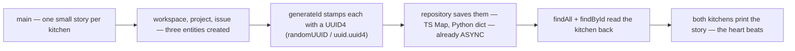

# Day 01 — Types and Async

---

**TL;DR**
- **The heart beats twice:** two runnable skeletons, one per kitchen — 12 files: entities, `generateId`, a heartless in-memory repository, and a `main()` that runs create → save → query.
- **Status:** both tracks run and print the story (`pnpm dev` / `uv run`). No test suite existed yet on Day 1 — parity is *signatures*, checked by the reader, not a suite.
- **The dual-language ingredient list is canonical from here in:** `interface`↔Pydantic, `Date`↔`datetime`, `randomUUID()`↔`uuid4()`, `undefined`↔`None` — same dishes, different labels.
- **Headline gotcha:** Python environment hell — 6 dead ends in 28 minutes until `sudo apt install python3-venv python3-full`; plus pnpm's `approve-builds` gotcha for native builds.

---

## Built

Two skeletons, both with a heartbeat — 12 files, one per track, side by side: entities, IDs, a heartless in-memory repository, and an entry point that already runs create → save → query. The in-memory repository stands in for a database; we'll raze it on Day 3, same beats, new home.

- [x] `ts/package.json` — pnpm project config, tsx for dev, TypeScript 5.5 strict
- [x] `ts/tsconfig.json` — ES2022 target, ESM modules, strict mode enabled
- [x] `ts/src/types.ts` — Workspace, Project, Issue interfaces (Entities with identity)
- [x] `ts/src/ids.ts` — `generateId()` via `crypto.randomUUID()` (Value Object)
- [x] `ts/src/repository.ts` — `InMemoryRepository<T>` with async findAll/findById/save/delete
- [x] `ts/src/main.ts` — Entry point: create → save → query flow
- [x] `py/pyproject.toml` — uv project, pydantic>=2.0, Python 3.12+
- [x] `py/src/__init__.py` — Package marker
- [x] `py/src/types.py` — Workspace, Project, Issue Pydantic models with status validator
- [x] `py/src/ids.py` — `generate_id()` via `uuid.uuid4()`
- [x] `py/src/repository.py` — `InMemoryRepository[T]` with async methods
- [x] `py/src/main.py` — Entry point with `asyncio.run(main())`

## Learned

Two parallel kitchens, two sets of ingredients — the same recipe in different hands.

- **Entity vs Value Object**: A person is *someone* — you tell one person from another by who she is, not what she's wearing; a size or a weight is just a measurement, interchangeable with any equal one. Entities (Workspace, Project, Issue) are the *someone* class — they carry identity via `id`. Value Objects (the id itself) are the measurements — defined by attributes, not identity. This is the atomic DDD building block every repo starts with.
- **Dual-language type mapping** — the ingredient list in both languages, same dishes different labels:
  - TS `interface` → Python `Pydantic BaseModel` (runtime validation vs compile-time)
  - TS `Date` → Python `datetime`
  - TS `crypto.randomUUID()` → Python `uuid.uuid4()`
  - TS `async/await` → Python `async/await` (same keyword, different event loop)
  - TS `undefined` → Python `None`
- **Repository pattern**: The mailroom — your team talks to one counter, and nobody outside cares about the filing system behind it. Abstracting persistence behind `save/find/delete` means Day 3's PostgreSQL swap only touches the repository internals, not the business logic in `main.ts/main.py`.
- **Async from day one**: You order the pizza by phone and keep walking around the kitchen — the order still arrives, you just didn't stall the whole room. Even in-memory repos use `async`, so transitioning to real DB calls (asyncpg/Drizzle on Day 3) is a one-line change inside the method body — no signature changes needed.

---

## Broke & Fixed

### Python Environment Hell (09:04 – 09:32)
A restaurant delivered without plumbing, and the tools to install the plumbing weren't in the box either — 28 minutes of failed fittings. The chain:

| Attempt | Command | Why it failed |
|---|---|---|
| 1 | `python -m pip install pydantic` | No `python` binary on Ubuntu |
| 2 | `python3 -m pip install pydantic` | pip not installed |
| 3 | `python3 -m venv .` | Missing `python3.12-venv` package |
| 4 | `sudo apt install python3.12-venv` | Got it, but pip still broken |
| 5 | `sudo apt install python3-pip` | Still not working |
| 6 | `sudo apt install python3-full` | Still broken |
| 7 | `sudo apt install python3-venv python3-full -y` | **Finally worked** |
| 8 | `python3 -m venv .venv` → `source .venv/bin/activate` → `pip install pydantic` | ✅ Working |

Then **ripped it all out** (`deactivate`, `rm -rf bin include lib lib64 pyvenv.cfg`) to switch to `uv`.

**Lesson**: Ubuntu ships Python without venv or pip by default. The one-liner that works: `sudo apt install python3-venv python3-full -y`.

### Switching from pip to uv (12:26 – 13:22)
Torn out hand-drilled plumbing and called a professional.

| Struggle | What happened |
|---|---|
| Old venv cleanup | `rm -rf bin include lib lib64 pyvenv.cfg` repeated 3+ times across different dirs |
| `pip install .` / `pip install -e .` | Failed — no `pyproject.toml` existed yet |
| uv installation | `curl -LsSf https://astral.sh/uv/install.sh \| sh` |
| uv learning loop | `uv venv` → `uv sync` → `uv run python3 -m src.main` repeated 4 times, fixing imports each iteration |
| Final working run | `uv run python3 -m src.main` ✅ |

**Lesson**: `uv` completely replaces pip + venv. `uv venv` creates the env, `uv sync` reads `pyproject.toml` and installs deps, `uv run` executes within the env. No `source activate` needed.

### TypeScript Track Setup (13:54 – 15:08)

| Struggle | What happened |
|---|---|
| pnpm not installed | `npm i -g pnpm` |
| `pnpm init` + deps | `pnpm install -D tsx typescript` |
| tsx not found | Tried `npx i -g tsx`, `npx install -g tsx`, finally `npm install -g tsx` |
| esbuild native build blocked | `pnpm approve-builds esbuild` (pnpm requires explicit approval for native builds) |
| Full nuke restart | `rm -rf node_modules pnpm-lock.yaml && pnpm install` |
| Store prune | `pnpm store prune` |
| TypeScript generic type error | `Property 'id' does not exist on type 'T'` — `InMemoryRepository<T>` needed `T` constrained to `{ id: string }` |
| Final working run | `pnpm dev` ✅ |

**Lesson**: pnpm's `approve-builds` for native dependencies is a gotcha. The `pnpm store prune` command cleans up orphaned packages from the global store. Generic repo type constraint was the main code bug.

And the five code-and-config bugs the two kitchens drifted on — one row each:

| # | Bug | Picture | Why it broke | Fix |
|---|-----|---------|-------------|-----|
| 1 | **TS generic type error** | *The key doesn't match the lock.* | `Property 'id' does not exist on type 'T'` in `InMemoryRepository<T>` — the generic makes no promise that `.id` exists. | Constrained `T extends { id: string }` so `findById` can safely access `.id`. |
| 2 | **Python type mismatch** | *An envelope labeled "photo" containing a coupon — technically delivered, nobody trusts it.* | `id: UUID = str(uuid4())` — the annotation said UUID, the default was a string. Pydantic silently coerced; strict validation would have broken. | `id: str = Field(default_factory=lambda: str(uuid4()))` — type and value now match. Also `created_at: datetime = datetime.now` → `Field(default_factory=datetime.now)` — calling the function, not referencing it. |
| 3 | **Repository API drift** | *Two shops agreed to mirror each other, then one invented its own return policy.* | Python `delete(entity: T)` took a full entity object; TypeScript `delete(id: string)` took just the ID. The tracks were supposed to mirror. | Aligned Python to `delete(id: str)` — both tracks now have identical signatures. |
| 4 | **TS fire-and-forget** | *Ordered by phone and never picked it up — the caller hung up, nobody heard the kitchen.* | `main()` at the bottom of `main.ts` was called without `await` — unhandled promise rejections would be silently swallowed. | `await main()` at top level. |
| 5 | **SSH key / git push failure** | *Knocking at a door that doesn't exist — GitHub's side was fine, the alias in the doorbell config wasn't.* | `git push origin dev` → SSH permission denied — the `~/.ssh/config` had the wrong host alias. | `ssh -T git@github.com` to diagnose → `nano ~/.ssh/config` → `git push origin dev` succeeded. |

**Lesson that outlives the day:** parity on Day 1 is a *signatures* contract, and the mirror is checked by reader, not tooling — bugs 2 and 3 were both *silent* (Pydantic coerced; the two tracks simply disagreed) until the other kitchen compared. From here on, when the kitchens drift, the drift itself is the bug.

## Blocked / Deferred

- **Deferred to Day 3**: PostgreSQL schema, Drizzle ORM, real persistence layer.
- **Deferred to Deepening 1**: ULID/nanoid ID generation swap (current `uuid4` is sufficient for learning).
- **Carried forward**: In-memory repositories will be replaced with PostgreSQL-backed repos on Day 3.

---

## Request / Response Flow

> 🔩 **Format note.** Rendered below in **Mermaid** — the de-facto inline-diagram format for `.md` files: native on GitHub, VS Code, Obsidian, and any static site with a `mermaid` plugin, so the diagram follows the *note itself* without a hosted image.

### The entry story — main() is the day's only client

One client only: `main()`, driving create → save → query against the in-memory repository. Note the save is *already async* — that is the point of the diagram: Day 2 swaps this caller for HTTP routes without touching a signature, and Day 3 swaps the cellar underneath without touching the caller. There is no HTTP surface yet; the repository *is* the request boundary for the day.

| Format | Where it renders | Why you might swap |
|---|---|---|
| Mermaid (default) | GitHub, VS Code, Obsidian, any site with a plugin | the standing choice |
| PlantUML | any site with a plugin / hosted | richer UML shapes |
| Excalidraw (JSON embed) | dedicated pages | hand-drawn tone |
| Hosted image (PNG) | anywhere | zero renderer dependency, but the diagram no longer travels with the note |

---

## Commands Run

### Python Environment Setup (09:04 – 09:32)

| Time | Command | Outcome |
|---|---|---|
| 09:04–09:11 | `python -m pip install pydantic` → `python3 -m pip install pydantic` → `sudo apt install python3.12-venv` → `sudo apt install python3-pip` → `sudo apt install python3-full` | ❌ 5 attempts, all failed — pip/venv broken |
| 09:30 | `sudo apt install python3-venv python3-full -y` | ✅ Both packages together finally worked |
| 09:30 | `python3 -m venv .venv` → `source .venv/bin/activate` → `pip install pydantic` | ✅ First working env |
| 09:32 | `deactivate` → `rm -rf bin include lib lib64 pyvenv.cfg` | Ripped out — switching to uv |

### Switching to uv (12:26 – 13:22)

| Time | Command | Outcome |
|---|---|---|
| 12:26 | `cd tech-foundry/apps/taskflow/py` | Navigated to project |
| 12:28–12:37 | `rm -rf bin include lib lib64 pyvenv.cfg` (×3 across different dirs) | Cleaned old venvs everywhere |
| 12:38–12:41 | `pip install .` → `pip install -e .` | ❌ No pyproject.toml yet |
| 13:06 | `pip install uv` → `pip uninstall uv` | Wrong method — uninstalled |
| 13:10 | `curl -LsSf https://astral.sh/uv/install.sh \| sh` | ✅ uv installed properly |
| 13:12–13:22 | `uv venv` → `uv sync` → `uv run python3 -m src.main` (×4) | 4 iterations fixing types, imports, repo API |

### TypeScript Track Setup (13:54 – 15:08)

| Time | Command | Outcome |
|---|---|---|
| 13:55 | `npm i -g pnpm` → `pnpm init` | ✅ pnpm + package.json |
| 13:58 | `pnpm install -D tsx typescript` | ✅ Dev deps added |
| 14:00 | `pnpm approve-builds` | ✅ Native builds approved |
| 14:06 | `npx tsc --init` | ✅ tsconfig.json created |
| 14:58–15:04 | `pnpm dev` → `npx install -g tsx` → `npm install -g tsx` | ❌ tsx not found, wrong syntax, then ✅ |
| 15:06 | `rm -rf node_modules pnpm-lock.yaml && pnpm install` | ✅ Clean reinstall |
| 15:08 | `pnpm approve-builds esbuild` → `pnpm dev` | ✅ esbuild approved, TS working |

### Final Verification & Push (15:09 – 15:15)

| Time | Command | Outcome |
|---|---|---|
| 15:09 | `uv venv` → `uv sync` | ✅ Python env ready |
| 15:10 | `uv run python -m src.main` | ✅ Python track verified |
| 15:13 | `git push origin dev` | ❌ SSH permission denied |
| 15:13–15:14 | `ssh -T git@github.com` → `nano ~/.ssh/config` | Fixed SSH host alias |
| 15:15 | `git push origin dev` | ✅ Pushed to GitHub |

### The Working Commands (reference)

| Command | Track | What it does |
|---|---|---|
| `pnpm dev` | TS | Run TypeScript entry point |
| `npx tsc --noEmit` | TS | Type check without emitting |
| `uv sync` | Python | Install/update dependencies from pyproject.toml |
| `uv run python -m src.main` | Python | Run Python entry point |

---

## Outcome

End of day one: two hearts, both beating in memory.

- **Both skeletons run.** `pnpm dev` (TS) and `uv run python -m src.main` (Python) each print the same create → save → query story from the same 12-file shape.
- **The swap point is frozen.** The repositories are async, `Map`/`dict`-backed, behind save/find — Day 3's cellar (ADR-002) changes the *bodies*, never the signatures. The parity wall on Day 1 is signatures.
- **Named, not flaky — deferred debt:** ID generation (`uuid4` for now; ULID is Phase 2 — ADR-003) and persistence (in-memory is explicitly temporary — ADR-002). No test suite yet: "both kitchens print the same story" is a reader check, not an assertion — the asserting parity wall arrives with the later days.

---

## ADRs Created

| ADR | Decision | Status |
|---|---|---|
| [ADR-001](../adrs/adr-001-dual-language-track.md) | TypeScript 60% + Python 40% dual track | Active |
| [ADR-002](../adrs/adr-002-in-memory-repository.md) | In-memory `Map`/`dict` for Days 1-2, PostgreSQL on Day 3 | Active (temporary) |
| [ADR-003](../adrs/adr-003-id-generation-strategy.md) | uuid4 for Day 1, ULID planned for Phase 2 | Active (temporary) |

Both tracks use uuid4 from the start (`crypto.randomUUID()` in TS, `uuid4()` in Python). ULID is the planned upgrade for Phase 2.

---

## Preview: Day 2 — API Skeleton

> 🍜 *Day 1 built the two kitchens. Day 2 gives them a counter.* The restaurant gets its counter: guests arrive at the front of house, orders go back to the two kitchens, food comes out to the table — opening for business.

- **What's being built:** wrap today's in-memory repos behind HTTP endpoints.
- **Concepts:** REST routes, request/response cycle, framework routing (FastAPI decorators, Fastify route registration)
- **Headline gotcha:** the routing dial is per-kitchen (Fastify route registration vs FastAPI decorators) — the mirror here is the *route table and the status strings*, not the syntax.
- **Files:** `ts/src/server.ts` (Fastify app), `py/src/server.py` (FastAPI app), new `main.ts`/`main.py` entry points
- **Prerequisites:** Install `fastify` (npm) and `fastapi` + `uvicorn` (pip/uv) before starting
- **Connection:** Today's `InMemoryRepository` becomes the data layer behind each endpoint — same `findAll`/`findById`/`save` calls, now triggered by HTTP requests instead of `main()`

---

## Notes

- Prompt file used: `master.md` (day 01 ran from the rules file directly; no per-day prompt file exists).
- Roadmap reference: `tech-foundry/docs/roadmaps/v4/master.md`