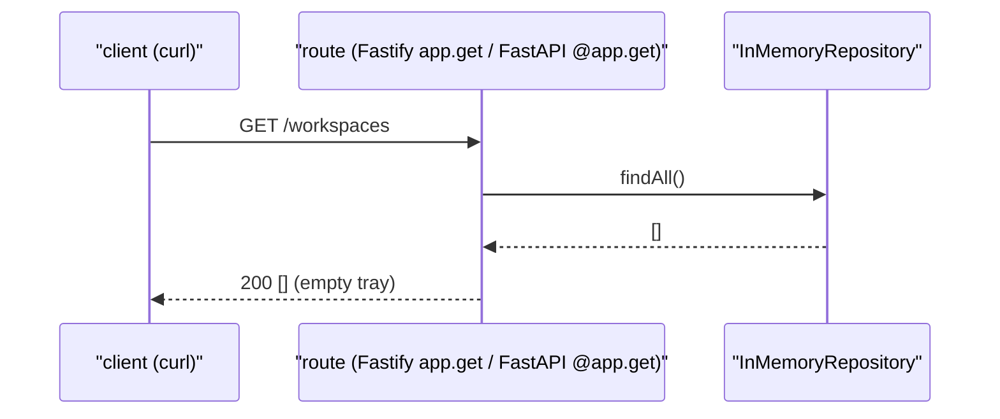

# Day 02 — API Skeleton (FastAPI + Fastify)

---

**TL;DR**
- **This is the first real request/response day.** Each counter now answers HTTP: 3 GET routes (`/workspaces`, `/projects`, `/issues`) on the in-memory repositories — the front of house is open.
- **The mirror is the route table + the JSON body, not the syntax.** Fastify registers with `app.get()` + callback; FastAPI with the `@app.get()` decorator — both return JSON the same.
- **Status:** `pnpm dev` / `uv run uvicorn src.server` serve empty `[]` on all three on both counters (verified with `curl`). No test suite yet — `curl` → `[]` on both is the check.
- **Decision locked:** `Fastify` (TS) + `FastAPI` (PY) — ADR-004.

---

## Built

The same kitchen, a counter window on top: 3 GET routes in each track, serving empty trays — no data yet, but the front of house is open.

- [x] `ts/src/server.ts` — Fastify server with 3 GET routes (`/workspaces`, `/projects`, `/issues`) backed by InMemoryRepository
- [x] `ts/src/main.ts` — Updated entry point: imports `startServer`, calls it on port 8000
- [x] `ts/package.json` — Added `fastify` and `@fastify/swagger` dependencies
- [x] `py/src/server.py` — FastAPI app with 3 GET routes backed by InMemoryRepository
- [x] `py/src/main.py` — Updated entry point: `uvicorn.run()` sync on port 8000
- [x] `py/pyproject.toml` — Added `fastapi` to dependencies, `uvicorn[standard]` to dev deps

---

## Learned

- **Fastify vs FastAPI parity**: Same station layout on both sides of the counter — an order comes in at the front, the kitchen does its work, food leaves as JSON. Fastify uses `app.get()` with callback, FastAPI uses `@app.get()` decorator. Both return JSON automatically.
- **`@fastify/swagger`**: A menu board that prints itself — the TS track gets auto-generated OpenAPI docs, the same idea as the menu FastAPI prints at `/docs`. Will be useful for API-first design later.
- **`uvicorn.run()` is synchronous**: The waiter stays at your table until the meal is done. Unlike Fastify's `app.listen()` which returns a Promise, uvicorn's `run()` blocks. The Python `main()` stays sync, no `asyncio.run()` wrapper needed.
- **`uv run` vs `uvicorn`**: `uv run uvicorn src.server:app` works directly — uv handles finding the right kitchen cabinet automatically. No `source venv/bin/activate` step.
- **Service DI pattern (Hoppscotch reference)**: The kitchen is given its set of knives once, before service — then the whole restaurant uses those knives. Creating repo instances at module level and injecting into routes mirrors Hoppscotch's service dependency injection pattern.

---

## Broke & Fixed

Two bugs, both born of the same false assumption — that *both* counters start the same way. They don't: Fastify `listen()` is a Promise, `uvicorn.run()` is a block.

| # | Bug | Picture | Why it broke | Fix |
|---|-----|---------|-------------|-----|
| 1 | **`await app.listen()` missing (TS)** | The sign said **OPEN** but the kitchen hadn't prepped — the console line fired before the restaurant was really listening. | `app.listen({ port })` returns a Promise; called without `await`, `startServer` returned immediately and the `console.log` fired before the socket was actually listening. | Added `await` before `app.listen({ port })`. |
| 2 | **`await uvicorn.run()` invalid (PY)** | *Treated a waiter who stays at your table as a courier who vanishes* — you can't hand a waiting task to a person who just stands there. | `uvicorn.run()` is a **sync** blocking call returning `None`; `await`-ing it throws `TypeError: object NoneType can't be used in 'await' expression`. | Made `main()` a regular sync function and dropped the `asyncio.run()` wrapper. |

**Lesson that outlives the day:** the dial is per-kitchen even for the trivial things *below* the counter — the *observable* must mirror (server up, same routes, same JSON body), but *how* it gets there (a Promise to `await` vs a blocking call you don't) is free to differ. Don't reach for the same verb on both just because it feels symmetric.

## Blocked / Deferred

- No blocks. Both tracks compile and serve empty arrays on all 3 endpoints.
- Day 3: PostgreSQL schema, Drizzle/asyncpg, replacing InMemoryRepository with real DB adapters.

---

## Request / Response Flow

> 🔩 **Format note.** Mermaid below — native on GitHub / VS Code / Obsidian, so the diagram follows the note.

Now there *is* a request boundary — `curl` is the client, and the request → response arc is the whole point of the day. No auth yet (that's Day 08's door); the three routes are open.



The mirror here is the **route table + the status + the JSON body** — identical whether the route is a Fastify callback or a FastAPI decorator. The one *free* knob is how the route is *registered*; the observable (route, status, body) is the parity wall. Same `[]` out on both counters.

| Format | Where it renders | Why you might swap |
|---|---|---|
| Mermaid (default) | GitHub, VS Code, Obsidian, any site with a plugin | the standing choice |
| PlantUML | any site with a plugin / hosted | richer UML shapes |
| Excalidraw (JSON embed) | dedicated pages | hand-drawn tone |
| Hosted image (PNG) | anywhere | zero renderer dependency, but the diagram no longer travels with the note |

---

## Commands Run

### Python Track (19:27 – 19:51)

```bash
cd py
uv venv                                    # Create virtualenv
source .venv/bin/activate
pip install fastapi                        # ❌ Failed — pip not in venv
sudo apt install python3-venv python3-full -y  # Fixed missing venv tools
python3 -m venv .venv                      # Recreated venv
pip list                                   # Verify clean env
source .venv/bin/activate
pip install fastapi                        # ✅ Installed
uv sync                                    # uv reads pyproject.toml
uv add fastapi                             # ✅ Added to pyproject.toml + lockfile
uv run python -m src.main                  # ✅ Entry point works (fixed typo: "oython" → "python")
uv run uvicorn src.server                  # ✅ Server starts
curl http://localhost:8000/workspaces      # → []
curl http://localhost:8000/projects        # → []
curl http://localhost:8000/issues          # → []
deactivate
```

### TypeScript Track (19:52 – 20:11)

```bash
cd ts
pnpm add fastify @fastify/swagger          # ✅ Added to package.json
pnpm i                                     # Install deps
pnpm dev                                   # ✅ tsx src/main.ts → http://localhost:8000
curl http://localhost:8000/workspaces      # → []
curl http://localhost:8000/projects        # → []
curl http://localhost:8000/issues          # → []
```

### Verification (21:25 – 21:29)

```bash
pnpm dev                                   # TS server on port 8000
curl localhost:8000/workspaces             # → []
cd py && uv run uvicorn src.server         # Python server on port 8000
curl localhost:8000/workspaces             # → []
```

---

## Outcome

End of day two: the front of house is open.

- **Both counters serve.** 3 GET routes each, empty `[]` on all three — the same records the repositories held on Day 1, now reachable over HTTP from `curl`.
- **The parity boundary moves to HTTP.** From here the *counter* is the surface that must mirror — same route table, same status, same JSON body, regardless of kitchen. Auth is not here yet (Day 08's door); these routes are open.
- **Deferred debt (named):** the data is still **in-memory** — Day 3 moves it into Postgres (ADR-002/005); `@fastify/swagger` generates docs but they're hand-untouched. No test suite yet; `curl` → `[]` on both counters is the check.

---

## ADRs Created

| ADR | Decision | Status |
|-----|----------|--------|
| [ADR-004 · HTTP Framework Choice (Fastify + FastAPI)](../adrs/adr-004-http-framework-choice.md) | **`Fastify` (TS) + `FastAPI` (PY).** Both auto-generate docs (a solo dev won't hand-maintain a document that lies); both async-first, both 10+ year ecosystems. A *permanent* decision — the dial is per-kitchen, the observable is shared. | Active (permanent) |

---

## Preview: Day 03 — PostgreSQL (the cellar)

> 🍜 *The restaurant pours its own foundation: we stand up the cellar (Postgres) and move the shelves from the cardboard box into it.*

- **What's being built:** PostgreSQL database, 3 tables (`workspaces`, `projects`, `issues`), replacing InMemoryRepository with real DB adapters

The restaurant pours its own foundation: we stand up the cellar (Postgres) and move the shelves from the cardboard box into it.

- **Concepts:** Database schema design, foreign keys (`workspace_id` pattern from Plane), Drizzle ORM (TS) / asyncpg (Python), Alembic migrations
- **Headline gotcha:** the DB dial is per-kitchen — Drizzle (TS) vs asyncpg (PY); the mirror is the **schema shape + the CRUD behavior**, not the query syntax.
- **OSS Reference:** Plane's `workspace_id` pattern for multi-tenancy, Ghost's migration approach

---

## Notes

- Prompt file used: `master.md` (day 02 ran from the rules file; no per-day prompt file exists).
- Roadmap reference: `tech-foundry/docs/roadmaps/v4/master.md`
