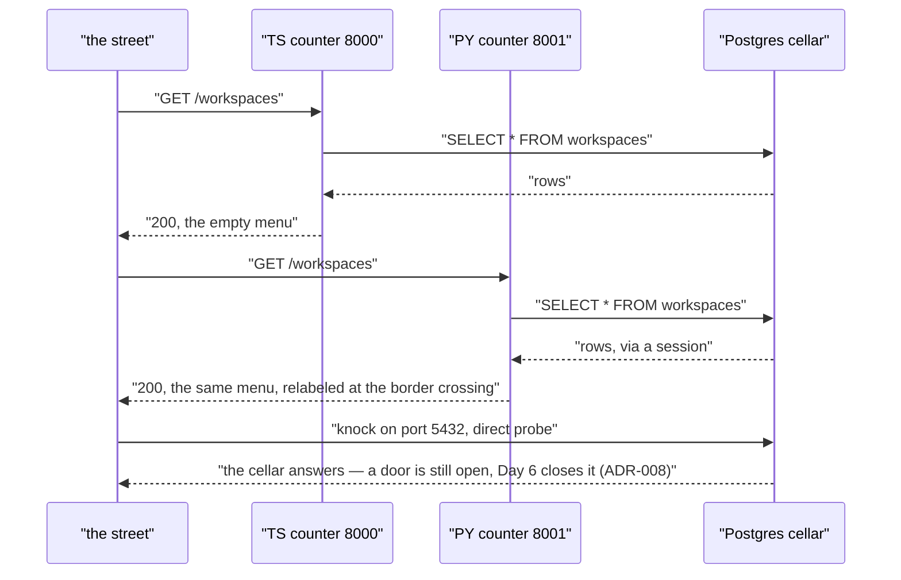

# Day 03 — PostgreSQL + ORM Integration (Day 3 of the Foundry)

---

**TL;DR**
- Postgres 15 now runs in Docker (port 5432) — the cellar is real.
- Both tracks persist to it: TS via **Drizzle ORM** (schema pushed at runtime), Python via **SQLAlchemy async** (tables created at startup).
- Both tracks serve all 3 GET endpoints from Postgres. Nothing blocked.
- **Gotchas:** 7 bugs total; **6 traced to one root — SQLAlchemy's async-ness** (missing `await` × 3, treating `Result` as a row, leaked sessions, a silent function-reference). All fixed — details in [Broke & Fixed](#broke--fixed).

---

## Built

> 🍜 *The restaurant pours its own foundation: the cellar (Postgres) and the shelving inside it. Only the front-of-house CRUD plumbing stands between this and tomorrow.*

- [x] `apps/taskflow/docker-compose.yml` — PostgreSQL 15 container, healthcheck, `postgres:postgres` creds, port 5432
- [x] `ts/src/db.ts` — Drizzle schema (`workspaces`, `projects`, `issues`) + `postgres` client + `initDb()`
- [x] `ts/src/repository.ts` — `PostgresRepository` (replaces `InMemoryRepository`: findAll, findById, save, delete for all 3 entities)
- [x] `ts/src/server.ts` — uses `PostgresRepository`
- [x] `ts/src/main.ts` — `initDb()` → `startServer(8000)`, top-level await
- [x] `ts/drizzle.config.ts` — Drizzle config for schema introspection/push
- [x] `ts/package.json` — added `drizzle-orm`, `postgres`
- [x] `py/src/db.py` — SQLAlchemy async engine + `async_sessionmaker` + `Base` + `init_db()` (auto-creates tables)
- [x] `py/src/models.py` — ORM models: `WorkspaceModel`, `ProjectModel`, `IssueModel` with FK relationships
- [x] `py/src/repository.py` — `PostgresRepository` (replaces `InMemoryRepository`)
- [x] `py/src/server.py` — `PostgresRepository`; FastAPI startup event calls `init_db()`
- [x] `py/src/main.py` — simplified to `uvicorn.run()` on port 8001 (init handled by the startup event)
- [x] `py/pyproject.toml` — added `sqlalchemy[asyncio]`, `asyncpg`

---

## Learned

### The two ORMs side by side

> 🍜 *Same kitchen, two kinds of recipe card.*

| | TS — Drizzle ORM | Python — SQLAlchemy async |
|---|---|---|
| What it is | Schema-first: tables defined in TS, typed SQL generated | Object-based: models map to tables; every operation is a session operation |
| Session model | Stateless — `db.select().from(t).where(eq(...))` directly | `create_async_engine()` + `async_sessionmaker` (+ `expire_on_commit=False`); **every** call is awaited |
| Schema → DB | `pnpm db:push` at runtime (and it can `ALTER`) | `Base.metadata.create_all()` at startup (**creates only; never `ALTER`s** — Day 4's headline gotcha) |
| Timestamps | DB-side `now()` default | `server_default=text("now()")` — *🍜 the oven stamps the date, not the cook*; Python's `datetime.now()` can't be a server default |
| Row → domain | typed rows | Pydantic `model_validate(row)` — *🍜 the border crossing: same package, relabeled on the way in* |

### Driver choice: `postgres` vs `pg` (TS)

> 🍜 *A fridge that arrived assembled, versus parts you bolt on yourself.*

- Chose **`postgres`** (postgres.js): one package, native `async/await`, no pool config.
- Skipped **`pg`** (node-postgres): requires `@types/pg` + a separate pool setup. Revisit in Phase 2 if pool tuning is needed.

### Three mechanics worth memorizing

- **Pydantic `model_validate(row)`** is the bridge from DB rows to domain types — one call, validated.
- **Drizzle `.returning()`** gets the inserted row back (Postgres `RETURNING *`) — needed for the DB-generated `created_at`.
- **FastAPI startup event** (`@app.on_event("startup")`) owns `init_db()` — tables exist before any request hits; `main()` stays clean.

---

## Broke & Fixed

Seven bugs. **Six come from one root idea:** async functions return *coroutines*, and Python lets you pass a coroutine around — silently — until something dereferences it.

| # | Bug | Picture | Why it broke | Fix |
|---|-----|---------|-------------|-----|
| 1 | `id=generate_id` (function, not call) in `saveWorkspace` / `saveIssue` | *Handing someone the description of a plumber, not the plumber.* | Passing the bare function passes the **object**. Python warns about nothing; the DB received `<function generate_id at 0x…>` as the id. | Add `()` — `id=generate_id()`. |
| 2 | Missing `await` on `session.get(...)` (all `delete*` / `find*ById`) | *Ordered a dish, then read the ticket as if the meal were already at the counter.* | Async `session.get()` without `await` returns a coroutine → the query silently returns nothing. | `await` every `session.get`. |
| 3 | Missing `await` on `get_session()` | *Holding the sealed box and treating the box as the contents.* | `get_session()` returns `async_session()` — a coroutine. Every method doing `session = get_session()` was really receiving a coroutine object. | `session = await get_session()`. |
| 4 | `execute()` result treated as a row | *Asked for a dish, was handed the whole tray.* | `await session.execute(select(...))` returns a `Result`, not a row. | Add `.scalar_one_or_none()` (or `.scalars().all()`) to extract rows. |
| 5 | Sessions never closed — connection leak | *Borrowed tools left on the floor all shift.* | Each request leaked a DB connection; they piled up until the process died. | `try/finally: await session.close()` around all session use. |
| 6 | `init_db()` called twice | *Two people flipping the OPEN sign.* | Manual call in `main.py` **and** the FastAPI startup event both created tables. | Removed the manual call; the startup event owns it. |
| 7 | Both tracks bound port 8000 | *Two restaurants, one address.* | TS and PY both listened on 8000. | PY moved to **8001**. |

**Lesson that outlives the day:** in async SQLAlchemy, `await` is a *load-bearing wall*, not a style choice. Bugs #1–#5 are one idea in five costumes.

---

## Blocked / Deferred

- No open blocks — both tracks serve all 3 GET endpoints from Postgres.
- Day 4: full CRUD — POST / PATCH / DELETE + validation (see preview below).

---

## Commands Run

Receipts, verbatim. All from `apps/taskflow/`; each dev loop ran the same cycle repeatedly (`docker compose down → up -d → push/sync → dev → curl`).

### Docker

```bash
docker -v                 # check Docker version
docker compose up -d      # start PostgreSQL 15
docker compose ps         # ✅ taskflow-postgres-1 healthy on 5432
docker compose down       # stop for config changes
```

### TS — install (Aug 18)

```bash
cd ts
pnpm install drizzle-orm postgres   # Drizzle ORM + postgres.js driver
pnpm install -D drizzle-kit         # CLI for schema push
pnpm i                              # install all deps
pnpm i -D @types/node               # fix: tried `npm i` first, switched to `pnpm`
```

### TS — dev loop (Aug 18 → night, repeated)

```bash
docker compose up -d
pnpm db:push    # push Drizzle schema to PostgreSQL
pnpm dev        # ✅ server on port 8000
curl http://localhost:8000/              # health
curl http://localhost:8000/workspaces    # → []
curl http://localhost:8000/projects      # → []
curl http://localhost:8000/issues        # → []
```

### TS — DB inspection (Aug 18 night)

```bash
psql                                                          # tried a direct client, switched to docker
npx drizzle-kit studio                                        # GUI for table inspection
docker compose exec -T postgres psql -U postgres -d taskflow -c "\dt"   # list tables
```

### PY — install (Aug 19)

```bash
cd py
uv sync                                   # sync existing deps
uv add sqlalchemy[asyncio] asyncpg        # fix: first tried `sqlalchemy[async]` (typo)
uv add --dev alembic                      # migrations, later use
```

### PY — dev loop (Aug 19, repeated)

```bash
docker compose up -d
uv run python -m src.main                 # fix: first tried `python3`, switched to `python`
docker compose ps                         # verify Postgres healthy
curl http://localhost:8001/workspaces     # → []
curl http://localhost:8001/projects       # → []
curl http://localhost:8001/issues         # → []
```


---

## Request / Response Flow

> 🔩 **Format note.** Mermaid below — native on GitHub / VS Code / Obsidian, so the diagram follows the note.

A request now has a cellar in it. One read — *menu in, shelved rows, menu out* — on both counters at once, and a table the **street cannot yet reach**:



The two counters read the **same three tables** — `workspaces`, `projects`, `issues` — and hand back **the same empty menu** in Phase 1's Day-2 shape. The cellar's open door is a *named open end on purpose*: it is dev's lighthouse, and Day 6 bricks it. What this day actually moved is *inside* the arrow: the repository is no longer a drawer in the kitchen, it is a separate room with its own door — the one day-02's preview queued.

### Both tracks (Aug 19, final verification)

```bash
docker compose up -d
pnpm db:push                # TS: re-push after schema changes
pnpm dev                    # TS: 8000 ✅  (curl /issues → ✅)
uv run python -m src.main   # PY: 8001 ✅
docker compose down
git push origin dev
```

---

## ADRs Created

| ADR | Decision | Status |
|---|---|---|
| [ADR-005](../adrs/adr-005-postgres-orm.md) | Postgres via Drizzle (TS) / SQLAlchemy async (PY) | Active |
| [ADR-008](../adrs/adr-008-postgres-doorless.md) | Dev defaults: `postgres:postgres`, no TLS | Active |

(Also retired today: [ADR-002](../adrs/adr-002-in-memory-repository.md) — the in-memory repository this day replaces.)

---

## Preview: Day 4 — Full CRUD Operations

> 🍜 *From a menu of one dish to the full menu.*

- **What:** POST create, GET by id, PATCH update, DELETE remove — ×3 entities = 6 endpoints per track, 24 total.
- **Concepts:** request-body parsing (Fastify schema / FastAPI Pydantic), path params, status codes (201 Created, 404 Not Found), **cascade deletes** (workspace → projects → issues), validation (no issue without a project), partial updates (PATCH only sends changed fields).
- **Headline gotcha (Day 4's real one):** `create_all` builds but never remodels — a Python-side FK/cascade change forces `docker compose down -v && up -d` + `pnpm db:push` (Drizzle remodels; SQLAlchemy's `create_all` is one-shot).
- **OSS refs:** Linear's issue API (Cmd+N create), Campaign's cascade pattern, Ghost's create/update mutations.

Today we only built the **R**. Day 4 adds the other three letters:

| Op | HTTP | TS (Drizzle) | Python (SQLAlchemy) |
|---|---|---|---|
| **C**reate | `POST /workspaces` | `.insert().values().returning()` | `session.add()` → `commit()` → `refresh()` |
| **R**ead | `GET /workspaces` | ✅ done this day | ✅ done this day |
| **U**pdate | `PATCH /workspaces/:id` | `.update().where().returning()` | `await session.execute(update(...))` |
| **D**elete | `DELETE /workspaces/:id` | `.delete().where().returning()` | `await session.delete()` → `commit()` |

---

## Notes

- Prompt file used: `docs/prompts/2026-08-14-1858-day-3-persistence-dual-track.md` (the day-03 box; the TS half started Aug 18 off the TS-only file `2026-08-12-1750.md`).
- Roadmap reference: `docs/roadmaps/v4/master.md` (Sprint 1, Day 3).
- Session operations recorded above (Jul 14 / Aug 18–19) are the verbatim receipts; the note was re-structured 2026-09-28 to the standing template (Flow section + closing Notes per doc-map §3.0).
