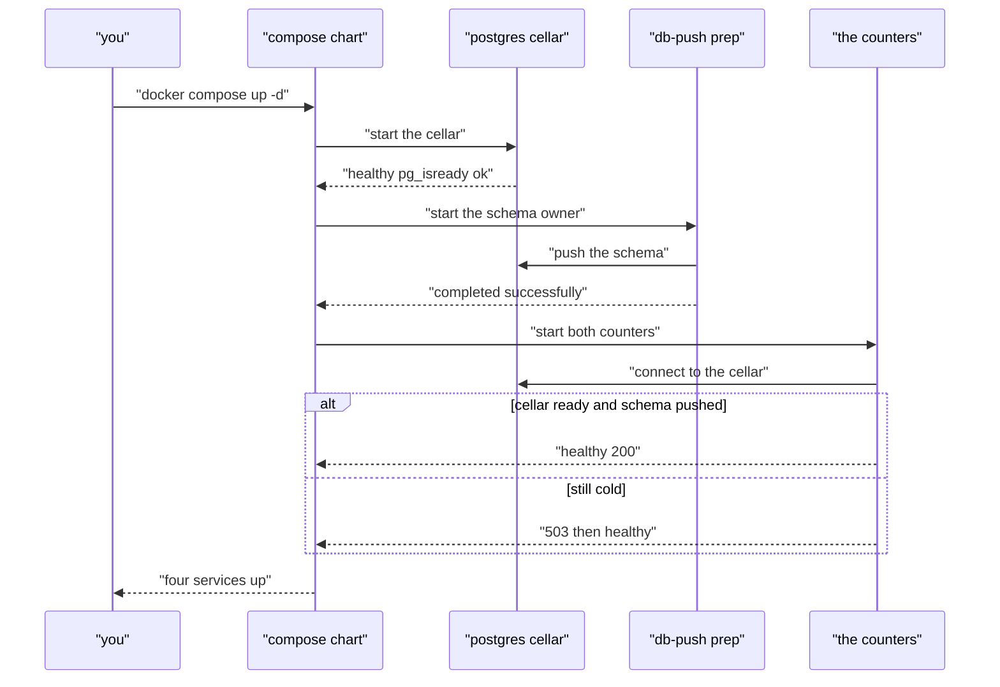

# Day 05 — Docker Compose (Postgres + App)

> Executed across Aug 28 → Sep 3, 2026 (Phase 1 — Make it Work, Sprint 1). Day-4's preview promised the restaurant moves into a *shipping container*: **one `docker compose up`** opens the whole place — cellar (Postgres), counter ×2 (TS:8000 / PY:8001), and the schema owner. It committed to "single compose, thin Dockerfile per track (`node:20` / `python:3.12` / `uv`), named volume, and `pnpm db:push` **first** (Day-4's DDL)." Delivered: all of it — plus a `db-push` *service* (better than a manual "step 1"), real app healthchecks, and a much longer **build/debug gauntlet** than the preview imagined. The two deviations below.

---

**TL;DR**
- **The restaurant moves into a shipping container.** One `docker compose up -d` opens the whole place — a `postgres:15` cellar, a one-shot `db-push` schema owner, and the two counters (`taskflow-ts:8000` / `taskflow-py:8001`) — all in one `apps/taskflow/docker-compose.yml`.
- **The named `postgres_data` volume lands.** The Day-3 "does `down` wipe data?" mystery is over: data survives `down`; only `down -v` / `prune` demolishes the cellar.
- **The "schema first" rule becomes a service.** `depends_on: service_completed_successfully` (db-push) + `service_healthy` (postgres) — so one `up` is genuinely one command.
- **Status:** 4 services `up` / `healthy`; `/stats` **12/11/10/10/10/4 identical on both ports** (same cellar, two taps); the Day-4 contract + cascade stay live, now *in the box*.
- **Headline gotcha:** pnpm's **no-TTY bail** in the image (fixed with `CI: "true"`) and a **build-vs-mount `node_modules` drift** that unblocks *dev* but is *the Day-6 deploy gate*. Two documented deviations: `node:20 → node:22-alpine`, and the `node_modules` / `uv.lock` story deferred to Day 6.

---

## Built

The whole restaurant now ships on one pallet — four services in one `docker-compose.yml`, each on a thin Dockerfile, so one `up` opens cellar + both counters + the schema owner.

- [x] `apps/taskflow/docker-compose.yml` — a `postgres:15` cellar, `taskflow-ts`, `taskflow-py`, and a one-shot **`db-push`** schema-owner; `postgres_data` named volume; `db-push` runs `pnpm db:push` *before* the apps boot (`depends_on: service_completed_successfully`).
- [x] `ts/Dockerfile` — `node:22-alpine` + corepack pnpm + `pnpm install --frozen-lockfile` + `pnpm dev`.
- [x] `py/Dockerfile` — `python:3.12-slim` + uv + `uv sync --frozen --no-dev --no-install-project` + `uv run python -m src.main`.
- [x] `ts/.dockerignore` + `py/.dockerignore` (keep `.venv`/`node_modules`/build out of the *context*); root `.gitignore` (`.venv/`, `__pycache__`, build artifacts) — the `.gitignore` was **untracked** at the start and got *committed* for the Dockerfile.
- [x] **`db:push` first, in the box** — the Day-3/4 "schema must run before the app" rule, *encoded as a service* so `docker compose up` is genuinely one command.
- [x] **Healthchecks + `start_period: 10s`** on both apps — a real "the counter is serving orders" signal, not a blind sleep.
- [x] **`server.ts` `process.env.PORT ?? 8000`** — the container's `8000`/`8001` binding actually works; without it Fastify ignored the PORT.
- [x] **Shipped** — committed + pushed as `e5c518b feat: Introduce Docker Compose setup` (= `origin/dev`).

## Learned

- **Recipe vs seating chart.** The *Dockerfile* is a recipe (immutable, layer-cached); *compose* is the seating chart (mutable, hot). Same kitchen, two verbs: the app containers `build` once, then *mount* source at run-time so a code edit is a `restart`, not a rebuild — the Day-4 "rebuild after DDL" lesson, wearing Docker clothes.
- **`uv sync --frozen --no-dev --no-install-project`.** Locked deps, no test harness in the image, and `--no-install-project` means "don't install *ourselves* into site-packages" — the source of truth stays in `/app` (the `COPY . .` + run-from-`/app` path), so there's exactly one copy of `src`.
- **The pnpm-in-a-box TTY trap → `CI: "true"`.** pnpm detects "no controlling terminal" inside a non-interactive container and *bails* on the interactive prompt — the classic "works in my terminal, dies in the image." The one-line `CI: "true"` is the known unblock; it's a *run* env, not a code change.
- **Honest healthchecks.** `wget --spider` returns 0 on *any* HTTP response — a `503` from a not-yet-ready Fastify counts as "alive-ish," so the app is `running` but *unready*; the `127.0.0.1` (not `localhost`) probe + `start_period: 10s` is what flips it to `healthy` without a false negative. A 503/500 is *information*, not a crash — the Day-4 contract, observed live from the container.
- **Two "ready" verbs in one `depends_on`.** `postgres` waits to be *healthy* (still up = a tenant); `db-push` waits to have *finished* (runs once = prep). "service_healthy" vs "service_completed_successfully" is the difference between "the landlord is here" and "the prep crew clocked out."
- **Anonymous volume → named volume (the Day-3 mystery, resolved).** The cellar gets a *deed*: `postgres_data:/var/lib/postgresql/data` + top-level `volumes: postgres_data` → `docker volume ls` names it, data survives `down` *without* `-v`, and `down -v` is the only demolition. The `/app/__pycache__` **anonymous-volume** trick keeps Docker's own layer from being clobbered by the host mount over `/app` — an *anonymous* volume on the *app* side, a *named* one on the *DB* side.
- **OSS**: Plane (a full multi-service compose stack — the closest sibling), Streamlit (a minimal single-image Dockerfile), Fastify + uv as the two "thin" entrypoints.

---

## Broke & Fixed

The long gauntlet the preview hinted at, as the record that outlives the day:

| Problem | Where | Found by | Status |
|---|---|---|---|
| pnpm **bails on the interactive prompt / no TTY** in a non-interactive container build — the `pnpm install --frozen-lockfile` layer never completes | `ts/` `docker build` | me | ✅ Fixed — added `CI: "true"` run-env |
| `node:20` base too old for pnpm's own postinstall ESM — the working image is **`node:22-alpine`** (the preview said `node:20`) | `ts/Dockerfile` | me | ⚑ **Deviation ①** (documented, kept) |
| Runtime **`ERR_MODULE_NOT_FOUND` for a bare-specifier (`./ids`)** — the host source *mount* shadowed `/app/node_modules` with a host tree in a different *build* shape than the image | `ts/` runtime + `docker-compose.yml` | me | ✅ Fixed in dev (`./ts/node_modules:/app/node_modules:cached` + real host `pnpm install`) — the *deploy* resolution is the **Day-6 gate** |
| **`db-push`** hit the same `ERR_MODULE_NOT_FOUND` (image-vs-mount drift on the one-shot service) | `db-push` service | me | ✅ Fixed — same node_modules-mount fix; schema applied on the first `up` in the box |
| App reported **`unhealthy`** (a false alarm) — an `inspect .State.Health` crawl (12:19 → 13:26) proved the app *was up* (Fastify 503 until the push), so the signal was *correct* | `docker-compose.yml` healthchecks | me | ✅ Fixed — `start_period: 10s` + a `127.0.0.1` probe (a 503 is *information*, not a crash) |
| A reflexive **`docker system prune -a`** (~14:52) deleted the just-built image → forced a full rebuild | manual | me | ⚑ Lesson only — don't `prune -a` mid-iteration, or tag the image so it isn't dangling |
| **`uv` rewrote `uv.lock`** during a py build (~17:50; the image's uv differed from the uv that *wrote* the lock) | `py/Dockerfile` build | me | ✅ Clean again; **lockfile-pinning = Day-6 gate ②** (pin uv in `py/Dockerfile`) |

Net of the gauntlet: **two real build bugs fixed** (`CI: "true"` + `node:22`), **one runtime mount-drift fix applied in dev** (the *deploy* resolution is the Day-6 gate), **one honest healthcheck tuning** (`start_period` + `127.0.0.1`), and **two documented deviations** (`node:20 → node:22-alpine`; the `node_modules` deploy story deferred) plus a `uv.lock` churn logged.

---

## Blocked / Deferred

All four land in **Day-6's entry cost**, in order:

- **① The `node_modules` story.** The `:cached` host mount is a *dev* shortcut (no rebuild on a code edit); the *deploy* must resolve it definitively — **embed deps in the image** vs **`pnpm install` on the AWS box**. Day-6 gate ①.
- **② `uv.lock` version-pinning** in `py/Dockerfile` (the drift above). Day-6 gate ②.
- **③ The named volume is now at stakes.** `down -v` on the *production* box would wipe a real DB (the Day-3 cellar lesson, at stakes) — the deploy recipe needs an explicit "this is your data" step. Day-6 gate ③.
- **④ `8000` / `8001` → a public URL.** Compose maps to localhost today; the deploy maps to the AWS host (and the `127.0.0.1` healthcheck must keep pointing *inward* once the app is public).

---

## Request / Response Flow

> 🔩 **Format note.** Rendered below in **Mermaid** — native on GitHub, VS Code, Obsidian, so the diagram travels with the note. (Alternatives in the box at the bottom.)

Day 5 has no *client* request to draw — the request now comes from *you*, and the real R/R is the **boot / readiness handshake**: who waits for whom, and how the health-signal flips. One `alt` covers the app's cold boot (503 → 200).

### The one `up` — cellar, prep, then the counters (the two "ready" verbs)

The two `depends_on` conditions *are* the "schema first" rule, encoded — and neither can be faked with a bare `service_started`:

| Condition | Waits for | Why `service_started` alone is not enough |
|---|---|---|
| `postgres: service_healthy` | the cellar's `pg_isready` returning ok | a `running` cellar can still be mid-recovery — *healthy* is the real "tenant is in" |
| `db-push: service_completed_successfully` | the one-shot `pnpm db:push` finishing | the schema must exist before a counter serves, or the app boots against missing tables |

And the parity is the **`/stats` ticket** — same cellar, two taps, identical rows on `:8000` and `:8001` (12/11/10/10/10/4). The Day-4 error contract + cascade ride along *in the box*: a `503`/`500` from a counter is the Day-4 contract, observed live from a container.

| Format | Where it renders | Why you might swap |
|---|---|---|
| Mermaid (default) | GitHub, VS Code, Obsidian, any site with a plugin | the standing choice |
| PlantUML | any site with a plugin / hosted | richer UML shapes |
| Excalidraw (JSON embed) | dedicated pages | hand-drawn tone |
| Hosted image (PNG) | anywhere | zero renderer dependency, but the diagram no longer travels with the note |

---

## Commands Run

### By user (usual terminal)

A build/debug gauntlet across `apps/taskflow/` (reconstructed from `~/.zsh_history` for the span; representative, not exhaustive):

- **Build the image** — `docker build -t taskflow-ts` (many iterations; the first attempts hit the pnpm-`CI` + `node:22` issues above).
- **Rebuild the cellar + apps** — `docker compose down -v --remove-orphans` → `docker compose up -d` (the Day-3 *reset recipe*, now with the named volume and 4 services).
- **Diagnose the "unhealthy"** — `docker inspect --format='{{json .State.Health}}' taskflow-taskflow-ts-1`, `docker compose logs taskflow-ts`, `docker ps -a`, `docker compose logs db-push`.
- **Find the volume deed** — `docker inspect --format '{{range .Mounts}}{{.Name}}@{{.Destination}}…' taskflow-*` (the 15:28 cluster that *saw* the `postgres_data` named volume in the mounts — the ground truth the ADR-006 correction was waiting for).
- **Clean up between builds** — `docker system df`, `docker images`, `docker image prune -a` (the ~14:52 one that ate the image), `docker volume rm $(docker volume ls -qf dangling=true)`.
- **Ship** — `git push origin dev` (09-04 10:20, after the `e5c518b` commit).

### By me (hidden terminal) — verification, with outcomes

- `docker compose up -d` → 4 services; `docker compose ps` → **all `healthy` / `Up`**.
- `curl 127.0.0.1:8000/stats` → TS `200 {"workspace":12,"project":11,"task":10,"label":10,"task_tag":10,"task_note":4}`; identical rows on `8001` (PY). **Same cellar, same 12/11, different faucet.**
- `curl -H 'X-Workspace-Id: ws-1' …/projects` on **both** ports → `200` `[proj-1…proj-11]` (**the `:cached` node_modules mount is working** — the Day-5 "fixed" gate).
- **Named-volume deed** — `docker volume ls` reports `taskflow_postgres_data`; both DBs `healthy`; `GET /` on `8000` + `8001` → `200` `{"message":"Hello World"}`. Data **survives `down`** (only `down -v` / `prune` demolishes the cellar) — the Day-3 ambiguity the ADR-006 correction closes.
- **Cascade still live on the named volume** — `POST → proj-1 → task-1` (201) → `DELETE /projects/proj-1` (200) → `/workspaces` still `200` `12` (the Day-4 FK, on the *named* DB).

---

## Outcome

End of day five: the restaurant is genuinely *in a box* — one `up`, one cellar, two counters, data on a named volume.

- **One `up` opens everything.** `docker compose up -d` brings up 4 services; the `db-push` schema-owner + the two app healthchecks make it genuinely one command (the Day-3/4 "schema first" rule, now a service).
- **The Day-3 volume mystery is closed.** Named `postgres_data` — data survives `down`, only `down -v` / `prune` wipes it. That ambiguity is now an explicit deed in the compose file (ADR-006 Field Notes).
- **Parity holds inside the box.** `/stats` 12/11/10/10/10/4 identical on `:8000` and `:8001`; the `:cached` node_modules + source mounts make both counters serve off *one* cellar; the Day-4 error contract + cascade are unchanged inside the containers.
- **Deferred (all named, all Day 6):** ① the `node_modules` deploy story (embed-in-image vs install-on-server), ② `uv` lockfile pinning in `py/Dockerfile`, ③ an explicit data-backup step now that the named volume is at stakes, ④ `8000`/`8001` → the public host (healthcheck stays inward). **Nothing else open going into Day 6.**

---

## ADRs Created

| ADR | Decision | Status |
|-----|----------|--------|
| [ADR-006 · **Docker Compose for Local Development**](../adrs/adr-006-docker-compose-dev.md) — **amended this day** | Day-3 "Day 5 decision **pending**" → **landed**: named `postgres_data` volume, `db-push` schema-owner service, app containers + healthchecks, `node:22` + `CI: "true"`. | Active |

No *new* ADR: at the 15:35 sync-check the reviewer leaned toward folding Day-5 into ADR-006 rather than a fresh record, so the `pending → landed` edit there is the canonical home *for now* (revisit if the named-volume + `db-push` decision outgrows a Field-Note entry). **ADR-008** (doorless Postgres, `!reset`) is a **Day-6** decision — the 2026-09-11 deploy incident — not this day. ADRs were **not committed** as a change this day.

---

## Preview: Day 6 (connect)

- **Roadmap §Sprint 1 Day 6**: "Deploy to Oracle Free Tier — SSH in, `docker compose up -d`, curl the URL." (The roadmap named the *target class* — a $0 VM, and its Oracle Free Tier tier was an *aspirational* plan; the box that actually shipped it was an **AWS EC2** `free_tier` VM: us-east-1, 2 vCPU ARM / 1GB, `54.208.101.60` — reverse DNS `ec2-…compute.amazonaws.com`. Same $0 economics, different cloud; the deploy recipe is provider-agnostic and never *touches* the provider.) The restaurant leaves the kitchen: the *exact* `docker compose up` that opens it here opens it on a **$0 AWS VM**.
- **The Day-5 stack *is* the deploy artifact** — so the deferred gates above become **Day-6's entry cost** in order: ① resolve the `node_modules` story (embed in the image vs install-on-server), ② pin `uv` in `py/Dockerfile` so the *server* resolves the same tree, ③ `8000`/`8001` → the public host URL.
- **The cellar is now at stakes** — `down -v` on the *production* box wipes a real DB forever; the deploy recipe carries an explicit data-backup step, and the `127.0.0.1` healthcheck keeps peering *inward* once the app is public. **Bar**: `curl http://<aws-host>/workspaces` returns the 12/11 rows after one `docker compose up -d` on the VM.
- **ADR-006** owns the dev-stack record; a **deploy** ADR lands in the Day-6 note's ADRs section.
- **"Watch out for"** — the *same* image-vs-mount drift that bit the Docker build will bite the **server** deploy if the `node_modules` story is left to luck.

---

## Notes

- Prompt file used: `master.md` (day 05 ran from the rules file; no per-day prompt file exists).
- Roadmap reference: `tech-foundry/docs/roadmaps/v4/master.md` (§Sprint 1, Day 5).
- **Executed across Aug 28 → Sep 3, 2026** — a multi-session build/debug gauntlet, so the *By user* commands above are a reconstruction from `~/.zsh_history`, not a single-session transcript.
- **ADR-006 is amended** (pending → landed) but *not re-dated*; it remains a Day-3-origin document. The old header's "ADR Reference" lives here: ADR-006 is the canonical record for the dev stack.
- Roadmap's Day-6 *target class* is the $0 VM (its aspirational "Oracle Free Tier"); the box that actually hosts it is **AWS** — corrected in the Day-6 note.
