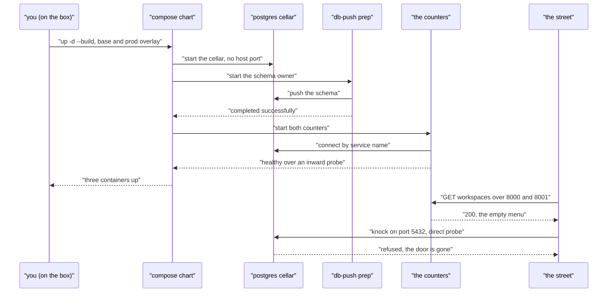

# Day 06 — AWS Free Tier Deploy (Day 6 of the Foundry)

---

**TL;DR**
- **The restaurant left the block and got a storefront address.** The *entire* box of Day 5 — both kitchens, the counter, the cellar, the pallet — shipped to an **AWS Free Tier** EC2 (`54.208.101.60`, us-east-1) and opened on one command: `docker compose -f docker-compose.yml -f docker-compose.prod.yml up -d --build` → 3 containers, no psql bridge.
- **The street gates passed from outside the block:** `http://54.208.101.60:8000/workspaces` → `200 []`; same on `:8001` → `200 []`; `nc -z …5432` → **refused** — both counters public by design, the cellar *doorless*, exactly as ADR-008 decrees.
- **ADR-008** (Postgres ships doorless — base `ports: []` + overlay `!reset []`) and **ADR-009** (overlay removal is done with `!reset`, never `~` or `[]`) — the two decisions of the 2026-09-11 incident, now committed.
- One headline gotcha: the *first* prod `up` **died before a single container started** — `port is already allocated for "0.0.0.0:5432"`; something else on the box already owned the cellar's door. The door came out of the building *entirely*, and the dead `up` turned green.
- **Deviation:** the v4 plan said *Oracle Free Tier*; the box that actually hosts this is **AWS** (2026-09-17 correction, in [Notes](#notes)). Same recipe, different cloud — the deploy is provider-agnostic.
- **Sprint 1 bar met** — the day-7 preview's promise, satisfied early: *a URL, working from the phone, two kitchens, one menu, a bricked cellar*.

---

## Built

- **The restaurant left the block and got a storefront address.** Today we took the *whole* restaurant — both kitchens, the counter, the cellar, the pallet — and put it on the AWS Free Tier box, with a door the whole street can knock on. *The deploy ran with base + overlay:* `docker compose -f docker-compose.yml -f docker-compose.prod.yml up -d --build`; from the *outside*, `http://<IP>:8000/workspaces` and `:8001/workspaces` answer.
  - **TS kitchen (`taskflow-ts:api`)** — baked from `./ts`, published by the prod overlay at `0.0.0.0:8000` (street). Serves `GET /workspaces` (menu). *Verified from the internet: `HTTP 200, body []`.*
  - **PY kitchen (`taskflow-py:api`)** — baked from `./py` (uv-frozen, ADR-009's `!reset []` drops the dev mount), published at `0.0.0.0:8001`. *Verified from the internet: `HTTP 200, body []`.*
  - **The cellar (`postgres`)** — `postgres_data` named volume, **no host port at all** (ADR-008: base `ports: []` + overlay `!reset []`). *Verified from the internet: `:5432` refused.* Reach it the only way there is now — `docker compose exec postgres psql -U postgres`. **3 containers on the box, no bridge service**: the door is *gone*, not re-routed — and manual access is the *deliberate verb* ADR-008 makes of it.
- **ADR-008** (Postgres ships doorless) and **ADR-009** (Compose overlay `!reset` semantics) — the two decisions from the 2026-09-11 incident, now committed and *externally verified*.

## Learned

- **The street can't touch the cellar — *but it *can* see through to it, and that is a *separate* wall.**
  The cellar (Postgres) has *no* door at all (ADR-008 `!reset []`): the *runtime* reaches it by service name over the internal compose network, and no host port is ever bound, so `:5432` from the street is *refused*. The *counters* (the two APIs on `8000`/`8001`) are the only things the street may knock on — *deliberately*, Phase 1's whole goal ("a URL that returns JSON, reachable from your phone"). The *receptionist* (the error contract, ADR-007) is where we'll bolt auth later; right now the counters are *unmanned* — the street can *read* an empty menu but there is no back-of-house door yet (Sprint 2, days 8-9). The two walls are different animals: the **cellar's** is *closed by design* (ADR-008); the **counter's** is *open by design for Phase 1* (no ADR — it is the roadmap's *whole point*: a URL that returns JSON), and it is *this* one the next phase bolts.
- **`!reset []` is a *veto*, not an *override* (ADR-009).** An overlay line *resets* the base list *to empty before merging*, so it wins over *everything* the base file declares — including a value a dev re-added locally. That is the only safe way for prod to be *stronger* than dev: the base file can say `127.0.0.1:5432` and *still* resolve to *no port* once the overlay `!resets`. Inverted-chart (`base = prod, overview = dev`) is the *mainstream* idiom and the *upgrade path* if this world grows past ~2 overlays; the veto pattern is *smaller today* and *stricter for prod**, so we keep it.

---

## Broke & Fixed

- **Error:** `docker compose -f … up -d --build` on the box failed *before a single container started*: `port is already allocated for "0.0.0.0:5432"`.
  **Root cause (story-first):** the cellar had a *door* — the base file's `- "5432:5432"` — bound to `0.0.0.0`. And *something else on the box* (a prior deploy's container) *already owned 5432*. So the *up* died at the door: a **port collision** turned into a **dead deploy**. The door was a *hidden load-bearing dependency*: the app containers never use it (they reach the cellar by service name), but the *up* needs the *host* port free to even *start*.
  **Fix (ADR-008):** bricked the *entire door away* — base `ports: []` + overlay `!reset []`. No port to collide, no `up` that can die on one. The *resolved* prod config now has *no* host port for the cellar at all.
  **Lesson:** never let a *host* port be a *silent* prerequisite of a deploy. If a port is bound, *someone* must be *on the host* to use it — and if that someone is a *human* in a *terminal*, that's *ergonomics*, not *architecture*: make it an *explicit* `127.0.0.1` mapping that the overlay *resets*, or an `exec` verb. A *collision-able* `0.0.0.0` port on a *data* store is a *load-bearing* bug, not a *convenience*.
- **Error (earlier, 2026-09-03, ADR-006):** renumbering the cellar door 5433→5434 to *dodge* a collision. This day we *removed* the door *itself* (ADR-008) — the *5434* bandage is *out*.

## Blocked / Deferred

- **Back-of-house door (auth) — *Sprint 2, days 8-9* (Auth0 per the v4 roadmap; Day 7 itself is Basic CI).** The counters are *public* by Phase 1 design; the *menu* they serve is *empty* (`[]`) on a *fresh* cellar, but there is *no* login in front of them *yet*. **Action:** AWS *Security Group* — *keep* `20/8000/8001` open (the storefront), keep `22 + 5432` closed (they *are*, and *stay* closed). Bolt the *counters* with Auth0 (Sprint 2) before *anything else* is allowed to reach *data* routes. *Not a defect today (empty cellar, no data) — it is the *next sprint.*
- **The box's `git` tip / *push* status** — *now confirmed from the Mac* (`git ls-remote origin`, 2026-09-11): GitHub `refs/heads/dev` = `9ee70f3`; **no `39a9fd0` exists anywhere on GitHub** (branches, tags, or otherwise) — `39a9fd0` is a *historical* amended twin of `9ee70f3` that the box's local `dev` points at, and nothing more. The divergence is *one-way and cosmetic* (identical trees, per the file reads; only a dev-tap port line differs, which `!reset` vetoes in prod anyway). Resolution is a git op *on the box*: `git fetch origin && git reset --hard origin/dev`, then the prod `up` re-runs as a *no-op* `Running` (resolved config is byte-identical) and the street gates (`:8000/:8001` `200`, `:5432` refused) pass unchanged. *Not a code defect — no app container needs touching.* **Resolved 2026-09-13:** the box re-probes clean — `HEAD = dev = origin/dev = 9ee70f3`, tree tidy, 3 containers healthy (`:8000`/`:8001` `200`, `:5432` refused) — the box already runs *this* lineage; nothing left to do.

---

## Request / Response Flow

> 🔩 **Format note.** Rendered below in **Mermaid** — the de-facto inline-diagram format for `.md` files: native on GitHub, VS Code, Obsidian, and any static site with a `mermaid` plugin, so the diagram follows the *note itself* without a hosted image. (Alternatives in the box at the bottom, should you ever want to swap.)

### One `up` on the street — pallet unpacks, both counters open, the cellar never gets a door (parse-checked, `mermaid.parse` OK 2026-09-22)

The street's two knocks are the day's whole *public face* — and they answer *differently* on purpose: the counters say `200 []` (the storefront, Phase 1's whole point), the cellar says *nothing* (ADR-008: no door, so there is nothing to knock on). The one request the street may make is `GET /workspaces`; the one port the street may *never* reach is `5432` — the difference is ADR-008 and ADR-009, drawn as an event instead of a policy.

| Format | Where it renders | Why you might swap |
|---|---|---|
| Mermaid (default) | GitHub, VS Code, Obsidian, any site with a plugin | the standing choice |
| PlantUML | any site with a plugin / hosted | richer UML shapes |
| Excalidraw (JSON embed) | dedicated pages | hand-drawn tone |
| Hosted image (PNG) | anywhere | zero renderer dependency, but the diagram no longer travels with the note |

---

## Commands Run

| Command | Outcome |
|---|---|
| `git pull --ff-only` (on the box) | fast-forwards `9ee70f3 → 39a9fd0` — *confirmed* from the Mac the same day: `39a9fd0` **was** on GitHub `dev` at this pull, and was later force-reset back to `9ee70f3` (see Blocked). |
| `docker compose -f docker-compose.yml -f docker-compose.prod.yml up -d --build` | 3 containers; ts + py *healthy*; postgres *up* (no host port — doorless). |
| `docker compose -f … ps` (on the box) | `taskflow-taskflow-ts-1` `0.0.0.0:8000→8000/tcp`; `taskflow-taskflow-py-1` `0.0.0.0:8001→8001/tcp`; `taskflow-postgres-1` *(no `->` at all — doorless)* — **3 containers, no psql bridge**. |
| `curl http://54.208.101.60:8000/workspaces` **from the street** | `HTTP 200`, body `[]` — *reachable, correct JSON, empty data*. |
| `curl http://54.208.101.60:8001/workspaces` **from the street** | `HTTP 200`, body `[]` — *reachable, correct JSON, empty data*. |
| `nc -z -G 5 54.208.101.60 5432` **from the street** | *refused* — **the cellar is doorless**; ADR-008 `!reset []` *is in effect on the box*, *despite* the base file *printing* `127.0.0.1:5432`. *The overlay veto wins.* |

---

## Outcome

End of day six: the restaurant is *open on the street* — the exact $0 box that hosts it is an AWS Free Tier EC2, and every wall it stands up is *invariant* now, not a hope:

- **One command opens the whole building** — the *same* `up` that opened it in dev opens it on the box, *plus* the prod overlay; 3 containers up, two `healthy`, the cellar *up* with no host port. The Day-5 *one-up* invariant survives the trip off-block.
- **Both counters are public by design** — `0.0.0.0:8000` and `:8001` answered `200 []` *from the street*; data is empty on a fresh cellar, which is what *should* happen.
- **The cellar is structurally doorless** — `:5432` refused from the street *despite* the base file printing `127.0.0.1:5432`; ADR-009's `!reset []` *is* in effect on the box. The class of failure that killed the first `up` is structurally gone from both machines.
- **Sprint 1 is complete** — *a URL, working from the phone, two kitchens, one menu, a bricked cellar* (the green build joins it in Day 7's CI).
- **Deferred, named, not flaky:** the one wall left open is the **counters'** — public *by Phase-1 design* (unmanned; the *next* sprint bolts auth, ADR-011, Sprint 2's days 8-9 per the v4 master). The AWS *Security Group* keeps `20/8000/8001` open and `22+5432` closed forever. The box's `git` twin diverged and is **re-probed clean** (2026-09-13: `HEAD = dev = origin/dev = 9ee70f3`) — nothing left open there.

---

## ADRs Created

| ADR | Decision | Status |
|-----|----------|--------|
| [ADR-008 · **Postgres ships doorless — no host port binding at all**](../adrs/adr-008-postgres-doorless.md) | the cellar's host door came out of the building *entirely* — base `ports: []` + overlay `!reset []`; manual access becomes the deliberate `exec` verb | Active |
| [ADR-009 · **Compose-file overlay removal is done with `!reset`, never with `~` or `[]`**](../adrs/adr-009-overlay-reset-removal.md) | *any* base declaration that must not ship to prod is cleared with `!reset []`; the overlay is a loud, permanent *veto* — proven by the `config` gate, not a comment | Active |

---

## Preview: Day 7 (Basic CI)

**Sprint 1's last day, and the *real* "is it actually *right*?" check — *automated*.** The *picture:* the restaurant is *open* and *reachable* — Day 7 per the v4 plan bolts on **Basic CI**: `.github/workflows/test.yml` — on *push*, `tsc --noEmit` (TS kitchen) + `pytest` (PY kitchen). The two walls stand as they are — cellar *bricked* (ADR-008), counters *public by Phase-1 design* — until *Sprint 2*.
- **CI green on push** — *the receipts, automatically*: a red type-check or a failed test becomes *visible on GitHub* instead of *possible in the tree*.
- **Cross-kitchen parity check** — the *test diner* (ADR-001): *same* request to `:8000` *and* `:8001` must return *the same* shape, status, and *error contract* (ADR-007) — the *manual* half of the same Day-7 proof; once the Action exists, this *becomes* a CI assertion, and the *two-kitchen* design (ADR-001) is *behaviorally* equivalent, not just *syntactically* similar.
- **Sprint 1 complete** — *"You say: 'Sprint 1 is deployed, here's the URL.'"* You *show:* the URL, *working* from the phone, *two* kitchens, *one* menu, a *bricked* cellar, a *green* build.
- **Then Sprint 2 (days 8-9):** **Auth0** — the *back-of-house door*; a *real, hosted* login in front of *both* counters (ADR-011 lands with it). The *street* gets `401` on *data* routes until it *proves* who it is. **This** is the wall the next phase bolts; it is *not* a Day-7 item.

---

## Notes

- Prompt file used: `tech-foundry/docs/prompts/` (no per-day prompt file exists for Day 6; the box was driven ad-hoc per the v4 plan).
- Roadmap reference: `tech-foundry/docs/roadmaps/v4/master.md` (§Sprint 1, Day 6).
- **Deploy executed 2026-09-11**; box re-probed **2026-09-13** (git twin reconciled, 3 containers healthy — see Blocked); provider label corrected **2026-09-17**.
- **⚠ Provider-label correction (2026-09-17).** Roadmap v4 §Sprint 1 Day 6 (and the Day-5 preview) named the *target* as the **Oracle Free Tier** — that was the *plan*. The box that **actually** hosts this deploy is an **AWS Free Tier** EC2 instance (`54.208.101.60`, us-east-1 — its reverse DNS resolves to `ec2-54-208-101-60.compute-1.amazonaws.com`; there was no Oracle Cloud account behind it). Everything in this note is *provider-agnostic* — `docker compose` on any $0 VM — and the only real provider coupling is the security-group naming ("Security List" → **Security Group**), so it stands unchanged except that label. Day-5's preview text and the v2/v3/v4 roadmaps retain "Oracle" where it is a *plan* artifact; for the *live deploy* this record is the correct one.
- **ADR-008** (Postgres ships doorless) and **ADR-009** (overlay `!reset` semantics) are the canonical records for *this* day's decisions; ADR-006 remains the canonical record for the *dev* stack they extend.
