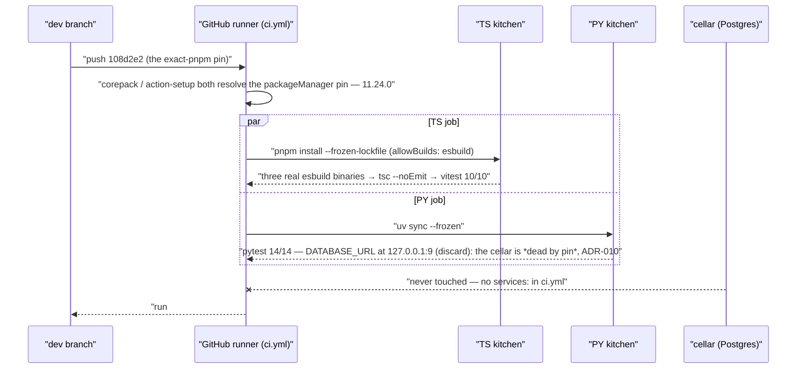

# Day 07 — Basic CI, and the pnpm supply-chain wall (Day 7 of the Foundry)

---

**TL;DR**
- `.github/workflows/ci.yml` landed: on **every push**, both kitchens are checked with **zero `services:` / no Postgres** — TS (exact-version install → `tsc --noEmit` → vitest 10/10) + PY (`uv sync --frozen` → pytest 14/14, cellar pinned *dead* via IANA port 9, ADR-010).
- One `packageManager` pin (**pnpm 11.24.0**) in `package.json` now drives local, CI, *and* the image (Corepack + `pnpm/action-setup@v4`) — three environments, one lockfile writer.
- **ADR-010** written *from the run*, not the plan: the gate tests the counter, never the cellar.
- **Status:** run #4 green, both jobs, 27s — the unknown (PY on the runner) resolved itself. `dev` ≡ `origin/dev`.

---

## Built

- **The inspector now comes by automatically — and the kitchens finally serve it an identical recipe.** The Day-7 CI action (`.github/workflows/ci.yml`): on every push, both kitchens are checked *without a human in the room* — the TS kitchen through **exact-version installs → `tsc --noEmit` → `vitest run`**, the PY kitchen through **`uv sync --frozen` → `pytest`**. Both jobs run on GitHub's runners with **zero `services:`, no Postgres at all** — *not* because the repositories are in-memory (that's ADR-002, retired by ADR-005 on Day 3), but by design (**ADR-010**): the suite asserts on the *counter* (status codes + ADR-007 envelopes), and the one test that reaches the cellar does so to pin the *cellar-down* script — `conftest.py` points `DATABASE_URL` at **`127.0.0.1:9`** (IANA *discard*), a port guaranteed to have no listener on a bare runner, so the opaque-500 path is asserted on *every* push, deterministically. A *live* cellar in CI would turn that test red.
- **One recipe, everywhere.** `packageManager: "pnpm@11.24.0"` in `apps/taskflow/ts/package.json` is now the *single* pin — Corepack in the Dockerfile and `pnpm/action-setup@v4` in CI both resolve through it (the Dockerfile's `corepack prepare pnpm@11.24.0 --activate`, the action's mirrored `version: 11.24.0` pin). The "three different pnpm versions across three environments" class of drift is closed: *local, CI, and image all run the lockfile's own writer.*
- **The zero-service gate is written down as a decision — ADR-010, `CI ships cellar-less`** (`docs/adrs/adr-010-ci-zero-service.md`, landing with the day-07 closure below): the gate *tests the counter, never the cellar*; the no-cellar path is *reproduced* (the port-9 discard), never *assumed*; the coupling is named in both directions (the 500 family *requires* a dead cellar — a future `services: postgres` must re-home those tests, and neither side may change blindly); the cellar upgrade (service + re-homed 500s) is parked for Phase 2, where the coverage bar starts. The rationale sits *where the trick lives*: the `# NO services: postgres — by design (ADR-010)` comment in `ci.yml` is already committed; its `conftest.py` twin (above the `DATABASE_URL` line) commits alongside the ADR.

---

## Learned

- **The pallet gained a supply-chain wall overnight, and it arrived while we were asleep.** Between this morning and the CI run, upstream pnpm shipped the **build-script wall** (pnpm ≥ 10 blocks dependency *install scripts* by default; pnpm 11 fails the install outright: `… ERR_PNPM_IGNORED_BUILDS`). esbuild — a transpiler dependency — is not a *source* that compiles in the box: it ships a small **downloader/installer** whose postinstall places the real binary. Blocked, **all** `pnpm install`s (image build included) produce a *missing transpiler binary*. The wall is not optional policy; it is the new default, so every package that needs a postinstall must be *named and approved* — the approval now lives in **`pnpm-workspace.yaml` under `allowBuilds`** (pnpm 11+ moves *all* settings there; the old `package.json` `pnpm` block and the old setting name `onlyBuiltDependencies` are both dead).
- **A workspace file is still the only hook for that approval — even in a one-kitchen house.** In pnpm 11+ an *omitted* `packages` field is legal: the root package alone *is* the workspace. In **pnpm 9** the same omission hard-fails (`packages field missing or empty`). The file is therefore a *version-fence*, not a monorepo tool: it works on 11+ and **cannot** run on 9 — which is why the pin in the previous bullet is not cosmetic, it is the load-bearing companion to the file.
- **The test diner still eats, but a blocked cook shows up as *slowness* first.** With esbuild's postinstall blocked, `vitest` ran *green* — it only *transforms* via esbuild in the default config; the wall surfaced in the run's self-report (`Transform 396%`) and in a missing binary, not in a failed assertion. *Lesson: a green test suite is not a proof that the toolchain finished installing — check the binaries.*

---

## Broke & Fixed

- **Error (this morning, CI — the day's headline):**
  ```
  Run pnpm install --frozen-lockfile   (apps/taskflow/ts, `run.working-directory`)
  ERROR  packages field missing or empty
  Error: Process completed with exit code 1.
  ```
  *(The run was `646d75e` — the workflow's first push; it died in this line, before touching a package.)*
  **Root cause:** the *committed* `ts/pnpm-workspace.yaml` — which **landed on Day 1, a month before CI (`7de14b4`)** — is a **pnpm 11+ settings file** (no `packages` key; in 11+ the root package *is* the workspace, and the same shape in pnpm 9 *hard*-fails) while the *brand-new* workflow pinned **pnpm 9**. Every `pnpm install` in CI died in its first line, before touching a single package. The wall that broke the day was therefore a *Day-1 file*, not a new one. (One working-tree detour was rescinded before commit — briefly re-anchoring the job at the repo root, a dead end since root has no `package.json` for the action to read `packageManager` from; it never reached a commit.) The job's *real* second issue was the lockfile path for `actions/setup-node@v4`'s `cache: pnpm` (root-relative, or it hard-fails): the two intervening commits (`70ab26e`, `74c18db`) fixed that — run #3 shows `setup-node` green and *the install* red.
  **Fix** (`108d2e2`): pin the action to the *exact* pnpm the lockfile was written with — `pnpm/action-setup@v4` at `version: 11.24.0` (Dockerfile's corepack pin included, per the commit subject; the earlier run #1's `packages field missing` was the same Day-1 file read by the *wrong* pnpm — the wall was a month old). Verified locally — *and then on the runner*: clean `rm -rf node_modules` → `pnpm install --frozen-lockfile` → all **three** esbuild binaries real and runnable (0.18.20 / 0.19.12 / 0.28.2) → `tsc --noEmit` clean → **10/10 tests, 3 files, 0 failures**.
- **Error (this afternoon, local — the second tooth of the same wall):** after the pin moved everything to 11.24.0, a bare `pnpm install` in `ts/` hard-failed with `… ERR_PNPM_IGNORED_BUILDS` and *wrote the approval file fresh* — `allowBuilds: esbuild: set this to true or false` is pnpm's **placeholder**, a pending prompt left behind because a non-interactive CI shell cannot answer it. **Fix:** the map *is* the answer — `esbuild: true` (unversioned, covering all current **and future** minor bumps — `esbuild: true` approves the bare name; the pinned, per-version key *does nothing*, a dead trap). Install then exits 0 with **zero** ignored-builds output, no lock drift.

## Commands Run

| Command (in `apps/taskflow/ts` unless noted) | Outcome |
|---|---|
| `pnpm --version` | `11.24.0` (local, Corepack) — the lockfile's own writer |
| `rm -rf node_modules && pnpm install --frozen-lockfile` | exit 0 — *and* the workspace file *exists* (ommitted `packages` accepted on 11+) |
| `node -e …` executing each `node_modules/.pnpm/esbuild@*/node_modules/esbuild/bin/esbuild --version` | `0.18.20` `0.19.12` `0.28.2` — **all three binaries real and runnable** (postinstall approval took) |
| `pnpm exec tsc --noEmit` | clean, exit 0 |
| `pnpm exec vitest run` | Test Files 3 passed (3) · Tests 10 passed (10) |

### GitHub runs (as they landed)

| Run | On push | Result |
|---|---|---|
| #1 | `646d75e` | red — `packages field missing or empty` (the Day-1 `pnpm-workspace.yaml` read by a pnpm that pre-dates its shape) |
| #2 / #3 | `70ab26e`, `74c18db` | `setup-node` green, install red (lockfile-path fix in flight) |
| #4 | `108d2e2` | **green, both jobs** — PY 14s · TS 23s (10/10) · 27s end-to-end |

### Commands (run by me, hidden terminal; reproducible on `dev`)

| Command | Result |
|---|---|
| `pnpm --version` | `10.14.0` — the runner runs pnpm 10.x natively → the day's one *code* fix is the `packageManager` pin, no `pnpm/action-setup` needed. |
| `grep packageManager apps/taskflow/ts/package.json` | absent — the field was never set → pinned `10.14.0` (TS), `uv 0.11.19` in `py/pyproject.toml` (PY: local `uv` is 0.9.17, so the runner pins *forward* — the one **known unknown**, later *resolved* by run #4). |
| `uv add --frozen -g dev vitest httpx aiosqlite` (py) | adds the three dev deps **without touching the lockfile** — the `httpx`/`aiosqlite` deps were already declared on day 3 but no test consumed them ("the library was installed, no test ever imported it"). |
| `pnpm add -D vitest` (ts) / `uv run pytest -q` / `pnpm run test` | 14/14 in ~12s (PY, includes 11 DB-gated cellar tests) / 10/10 in ~7s (TS: 6 ids, 3 contract, 1 type) — both tracks green **with no cellar and no node_modules**. |
| `pnpm tsc --version` | `6.0.3` — the TS track is on **TypeScript 6.0.3** (tsc silent → `tsc --noEmit` clean). |

(The closeout commit is the user's — rules 13/16: I stage, show the diff, propose the message, the user commits. Three files: ADR-010 `+62`, day-07 note `+15 / −8` — *Built* rewritten from plan to *happened*, *Broken* on the real chain, *Blocked* → *Outcome*, `646d75e` dropped, ADR-010's rule-12 sections added — conftest `+4` (comment-only). The Day-8/9 prompt file is new; it carries the preview section as its own *ask*.)

---

## Request / Response Flow

> 🔩 **Format note.** Mermaid below — native on GitHub / VS Code / Obsidian, so the diagram follows the note.

A push now walks the inspector's full round — *and the inspector never opens a cellar door*:



*The cellar is the one participant that takes no part — and the 500 family is the test that *wants* it to stay that way* (a live `services: postgres` in Phase 2 must move it; the coupling is named in ADR-010 in both directions).

---

## Outcome (closed 09-16 with the GitHub run results)

- **The pin landed and the inspector stopped flinching.** `108d2e2` pushed → **run #4: green, both jobs** — `Python – pytest` 14s, `TypeScript — tsc + vitest` 23s (10/10, summary posted to the run), 27s end-to-end. The *known unknown* from the day — the PY half (`uv sync --frozen` against the runner's uv 0.11) — **ran green on a real runner**; it was never a wall, the pnpm half had just been louder. Every push since (`7552159` → `1198269`) has stayed green.
- **`dev` is fully in sync with `origin/dev` (`1198269`)** — nothing above is "in the working tree, not pushed": the CI workflow, the version pin, the lockfile-cache commits, and both suites are all committed and pushed. The *only* work still pending from this day is three docs-only deltas, staged for one commit: the **ADR-010** file, the **Day-8/9 kickoff prompt** (`docs/prompts/day-08-auth0-2026-09-16-2106.md` — master.md's day-close step *before the closeout commit* says the next day ships with its kickoff file, and day 7 closed without one), and the ADR-010 comment on the committed `DATABASE_URL=…:9` line in `conftest.py` (same value, new comment — so the next reader who sees port 9 finds the *why* next to the trick instead of "fixing" it to 5432). All three are docs, **zero code** — the *behavioral* outcome above is *complete*; no code, tests, or lockfile changes ride in the closeout commit, and the `:9` line is byte-identical (comment-only delta).
  
- **Sprint 2 next**: the *back-of-house door* (Auth0, days 8-9) is what the roadmap queues after Day 7; the two *public-by-design* counters stand unchanged, and the inspector (now airtight) re-checks them on every push.

---

## ADRs Created

| ADR | Decision | |
|---|---|---|
| [ADR-010](../adrs/adr-010-ci-zero-service.md) | CI runs with zero services — *"CI ships cellar-less"*: no `services: postgres` in `ci.yml`; the no-cellar path pinned in `conftest` via IANA port 9 (discard); the 500 family as a test *welded to the gate design* (deliberately untested-with-DB in Phase 1; the cellar upgrade is Phase 2's "make it right"); ADR-008 (doorless deploy) as the *twin decision*; the live-DB smoke test and the TS `tsc`-only asymmetry recorded as the day's two *named* debts. | Written once the GitHub run resolved the day's one *unknown* (run #4, both jobs green), not on plan. |

---

## Preview: Day 8 — the back-of-house door (Sprint 2)

The inspector (CI) now guards the *recipe*; the next door guards the *data*. The street may read an *empty* menu, but data routes need to know *who's asking* — the counters (8000/8001) bolt on **Auth0** behind a *receptionist* (ADR-007), and the street learns to carry a *token* past it. Both kitchens must check the same token shape — the *parity* wall (ADR-001) now has a second gate besides the error contract.

---

## Notes

- Worked **Sep 15** (note timestamp `1151`); day closed **09-16** with the GitHub run results (the filename keeps the start — house style, like day-06).
- Roadmap reference: `docs/roadmaps/v4/master.md` (Sprint 2, Day 7).
