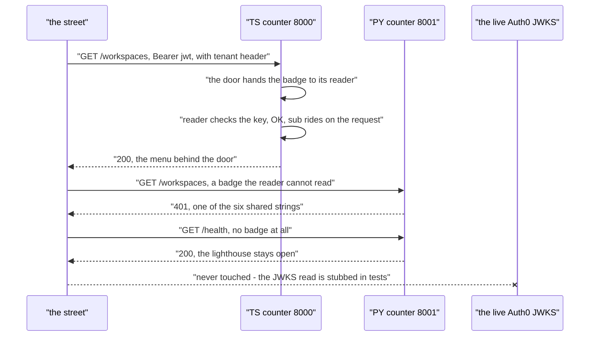

# Day 08 — Auth0: the Badge Reader (Day 8 of the Foundry)

---

**TL;DR**
- Both counters now verify Auth0 JWTs: **one thin door** (Fastify `onRequest` hook / FastAPI `BaseHTTPMiddleware`) in front of **one pure badge reader** (`verifyBadge(token, tenant, audience)`).
- **Parity now runs on the *strings*:** both tracks map their native JWT errors to the **same six 401 messages**. A different message by kitchen fails the suite.
- **The day's one real code delta:** TS `PUBLIC_PATHS` was missing `/health` — the lighthouse that CI and load balancers probe would have 401'd on the TS counter. Fixed + 2 tests.
- **Status:** TS 30/30, PY 18/18, `tsc` clean. The zero-service CI gate is **unchanged** (JWKS read is stubbed in tests; no `AUTH0_DOMAIN` = doorless).
- **Named debt:** the *live* JWKS path (real domain, real HTTPS) is untested in CI — deferred to Phase 2 (ADR-011).

---

## Built

### The door (both tracks)

> 🍜 *The restaurant gets a back-of-house door: a reader at the entrance that checks every badge. The kitchen itself never sees a badge.*

- TS: Fastify **`onRequest` hook** — `.addHook("onRequest", doorHook)` in `server.ts`.
- PY: **`BaseHTTPMiddleware`** — `.add_middleware(...)` in `server.py`.
- Door logic: read `Authorization: Bearer <token>` → call the pure `verifyBadge(token, tenant, audience)` → on failure, return the **ADR-007 envelope** with a **401**.
- One global reader at the front — not a per-route lock. One pure verifier behind one thin door is the shape: same inputs, same failure semantics, only the crypto differs between kitchens.
- **Scope:** the reader answers *who you are*. *Who may do what* (RBAC — owner / member / invite, after Plane's workspace-members) is the authorizer layer *above*, deferred to Day 10–11. v4's `identity/` root domain (Auth, Users, RBAC) begins here; today is **authentication only**.

### The reader (real JWKS, replacing the Day 3 stub)

> 🍜 *The old doorman waved everyone through. The new one actually reads the badge.*

- **The Day 3 stub** (`auth.ts` / `auth.py` returning a literal `{ sub: "dev" }`) is **demoted, not deleted**: it survives only as the **doorless path** — `if (!process.env.AUTH0_DOMAIN) return` (ADR-008's shape, generalized to the door).
- **Verification is remote JWKS** — the restaurant *reads and checks* a badge it never minted. No password endpoint, no token issuing.
  - TS: **jose** — `createRemoteJWKSet("https://{domain}/.well-known/jwks.json")`, RS256, issuer `https://{domain}/` (with the trailing slash Auth0 appends).
  - PY: **PyJWT** + a ~40-line hand-rolled JWKS reader: fetch → cache by `kid` → **one re-fetch** on an unknown `kid` (the key-rotation case), verifying with a `cryptography` `RSAPublicNumbers` key. (Named debt — Phase 2: harmonize or switch to a library JWKS provider.)
- **Attachment point:** `request.user` typed as `JWTPayload` on the Fastify request module; `request.state.user` in the PY middleware. This is the *one read* Day 10–11's ownership model inherits (`sub` = who's asking).

---

## Learned

### 1. The parity wall gained its first real teeth — the **failure strings**

> 🍜 *Same receptionist script, two kitchens. Different words, and the guest notices.*

- ADR-007 made the counters *look* alike (status codes + `{ statusCode, error, message }` shape). ADR-011 is the **second gate, and it is stringly**: the contract is the **same six 401 `message` strings** — `No token` · `Malformed` · `Expired` · `Wrong audience` · `Wrong issuer` · `Signature verification failed`.
- The engineering: map two different error worlds to that one contract.
  - TS: **jose v6** throws typed errors — `JWTExpired`, `JWTInvalidAudience`, `JWTInvalidIssuer`, `JWTDisclosure` (plus the `Signature verification failed` catch-all).
  - PY: **PyJWT** throws `ExpiredSignatureError`, `InvalidAudienceError`, `InvalidIssuerError`, `InvalidTokenError`.
- **Rule:** map via native `instanceof` — **never `parse .message`** (string-matching is the exact drift the wall exists to prevent). A kitchen may swap libraries; a different 401 *string* is a parity break and will red the suite.

### 2. The lighthouse must be open in *both* tracks

> 🍜 *CI and any load balancer ping the lighthouse, not the dining room. A dark lighthouse reads "closed."*

- The public set — `{ "/", "/docs", "/redoc", "/openapi.json", "/health" }` — stays **public by design** (ADR-010's no-cellar lighthouse + the OpenAPI menu) and must be **identical in both tracks**.
- Today's crack: TS `PUBLIC_PATHS` lacked `/health`; PY had it. (Fixed — see [Broke & Fixed](#broke--fixed).)
- Known cosmetic divergence: FastAPI ships `/redoc`; Fastify doesn't. So the TS test *stubs* a `/redoc` route — **the set stays 1:1; only the stub differs** (commented in the test).
- Now a **tested invariant**: add a route "public" in one track without mirroring the other → red on push.

### 3. Every new dependency re-opens the install wall (ADR-010)

> 🔩 *Day 7's pnpm build-script gotcha, at the door again.*

- New deps: `jose` (TS); `PyJWT` + `httpx` (PY).
- Mitigation (same shape as Day 7): **pin** `jose ^6.2.12` (TS), `pyjwt[cryptography] ^2.14` + `httpx ^0.28.1` (PY) — **and stub the JWKS read in tests** (no live network), so deps that *want* network ride inside the no-service gate without a live auth provider to bring the runner down.

### 4. "Doorless" is keyed to *one* variable

- Doorless = **`AUTH0_DOMAIN` absent, specifically** — *not* "no `AUTH0_*` vars".
- The trap: `AUTH0_DOMAIN` set *alone* still engages the reader, because audience has a `??` fallback — default `"foundry-taskflow-api-aud"`. So *domain set, audience unset* = **reader on**.
- That asymmetry is exactly why the suite stays green in CI: the gate runs with no env at all → the doorless path returns early. No live Auth0, no network, **no gate change**. (Noted in ADR-011: ADR-008's no-env-is-doorless story is keyed to this one var, not a blanket "no `AUTH0_*`".)

---

## Broke & Fixed

| # | Bug | Picture | Why it broke | Fix |
|---|-----|---------|-------------|-----|
| 1 | **Lighthouse crack** (the headline): TS `PUBLIC_PATHS` missing `/health` | *The PY lighthouse was lit; the TS one was a dark window.* | The door classified `/health` as a *data route* → TS counters 401'd health probes while PY served them open. ADR-010's no-cellar lighthouse (what CI **and** any load balancer pings) was red on one track. | Add `/health` to TS `PUBLIC_PATHS` + 2 lighthouse tests. `GET /health` → **200 with no token on both counters**; the mirror is asserted on both sides, so future drift reds on push. |
| 2 | A live JWKS fetch would 500 a zero-service runner | *A door with a network call that isn't on the script.* | The first PY draft let the JWKS fetch **throw a network error** the door didn't map to a 401 string — it fell through toward a **500**: the one shape ADR-007's receptionist forbids improvising on. | `mapFailReason` gains **`Signature verification failed` as an explicit `else`**: every unclassified input (network-down, unknown-`kid` after re-fetch, bad signature, *the JWKS fetch itself*) resolves to that **one opaque string**. Never 500, never a different string, never a silent pass. Fail-closed, no discretion to drift. |
| 3 | PY JWKS: key built from raw base64url — round-trip failed | *The badge looks right, but the engraving is off by a few pixels — the reader can't tell you apart.* | JWK `n`/`e` are **unpadded base64url**; `RSAPublicNumbers` wants DER. The first `pyjwt` round-trip on a **locally-minted** key failed with a "signature" mismatch that *looked* like a real Auth0 problem. | Decode base64url → **pad to %4** → big-endian `int` → `RSAPublicNumbers(e, n, …)` → `public_key()`. This ~40-liner (fetch → cache-by-`kid` → re-fetch-once) is the final reader. Verified in tests against a locally-generated keypair — no remote Auth0. |

**Lesson that outlives the day:** the parity contract lives in *observable strings and open/closed sets* — the envelope, the six messages, `PUBLIC_PATHS`. The implementation *may* differ (jose ≠ PyJWT); the *strings* may not.

---

## Request / Response Flow

> 🔩 **Format note.** Rendered below in **Mermaid** — the de-facto inline-diagram format for `.md` files: native on GitHub, VS Code, Obsidian, and any static site with a Mermaid plugin, so the diagram travels with the *note itself* without a hosted image.

### Every guest passes the reader - the six strings are the whole story

> 🍜 *A reader now stands at both entrances. It never argues with a badge - it recites one of six lines and turns the guest around.*

*The live JWKS is the one participant that takes no part - the same shape as the cellar did under ADR-010. The door engages only when `AUTH0_DOMAIN` is set; CI never sets it, so the street sees the reader's six strings against **stubbed** keys, deterministically.*

**Alternatives box** (kept here, per the house template, for day-8+ readers):

| Format | Where it renders | Why you might swap |
|---|---|---|
| Mermaid (default) | GitHub, VS Code, Obsidian, any site with a plugin | the standing choice |
| PlantUML | any site with a plugin / hosted | richer UML shapes |
| Excalidraw (JSON embed) | dedicated pages | hand-drawn tone |
| Hosted image (PNG) | anywhere | zero renderer dependency, but the diagram no longer travels with the note |

---

## Commands Run

Receipts, verbatim.

| Command | Outcome |
|---|---|
| `git --no-pager diff -- apps/taskflow/ts/src/auth.ts apps/taskflow/ts/tests/auth.test.ts` | 4 ins / 2 dels — the `/health` fix + mirrored lighthouse stub list (the day's only uncommitted code) |
| `pnpm -C apps/taskflow/ts exec tsc --noEmit` | clean, exit 0 (door hook + `request.user: JWTPayload` module augmentation type) |
| `pnpm -C apps/taskflow/ts run test` | 30/30 — adds 10 reader tests over Day 7's 20: the six-string contract, doorless no-tenant, fail-closed stranger-tenant, the lighthouse stays-open pair |
| `uv -C apps/taskflow/py run pytest -q` | 18/18 — PY reader suite: doorless, six strings on a locally-signed token, fail-closed, JWKS cache + one re-fetch, no-token, non-Bearer |
| `curl -s localhost:8001/health` + no-token `curl localhost:8000/…` | lighthouse + street stay open with `AUTH0_DOMAIN` unset (doorless) — ADR-010's gate invariant |

---

## Outcome

Local: closed green. Carried forward: one named unknown, declared below.

- **Both tracks green and mirrored.** TS: `tsc --noEmit` clean + 30/30. PY: 18/18. The parity is **asserted on the strings, both sides** — a 401 with a different `message`, or a lighthouse dark on one counter, fails the suite. The `/health` lighthouse crack is fixed in code and asserted in tests.
- **The zero-service gate is invariant.** ADR-010's "no `services:`" is unchanged: the door reads `AUTH0_DOMAIN` from env, the JWKS read is stubbed in tests — no live provider, no Postgres, no network on the runner. No-env is the doorless path, which *is* the no-env the gate already runs under.
- **The one unknown (declared as deferred debt, not flaked):** does the **live** JWKS round-trip — real `AUTH0_DOMAIN`, real `https` to Auth0 — hold in a real runner? That is ADR-010's "the gate tests the counter, never the cellar" applied to the door. Phase 2 will "make it right" (a live smoke, or a library JWKS provider + harmonization).
- **Branch state.** Uncommitted on `dev`: the 6-line `/health` fix (`ts/src/auth.ts` + `ts/tests/auth.test.ts`) **and** the new `docs/adrs/adr-011-auth0-badge-reader.md` — nothing else. The rest of the authenticator (reader + door + six-string verifier + the 30/18 suites) is already in `5a025ba feat(auth)` on `origin/dev` (the uncommitted work is relative to `a96d352`). One closeout commit with both files, then the **parity report** — Sprint 2's first *real* parity assertion: the contract strings + the street.

---

## ADRs Created

- **[ADR-011: Auth0 — the Badge Reader at the Counter](../adrs/adr-011-auth0-badge-reader.md).** Decision in one line: *the reader is a pure function behind a thin door, one per kitchen; the six-string 401 contract is the parity wall's second gate (after ADR-007's envelope); `PUBLIC_PATHS` (lighthouse + menu) stays public and mirrored; doorless = `AUTH0_DOMAIN` absent (keyed to that one var); fail-closed with an explicit `else`; the hand-rolled PY JWKS reader is a named debt → Phase 2 / Sprint 5; `request.user` is the one read Day 10–11's RBAC descends from.* (Written after the local green and before the live-JWKS unknown — the debt is *named* in it, not *solved*.)

---

## Preview: Day 9 — the same door, live (Sprint 2)

> 🍜 *Day 8 bolted the door. Day 9 turns it on.*

- **What changes:** a **real `AUTH0_DOMAIN`** in the compose / AWS env → the door engages against the real JWKS round-trip (the no-env-is-doorless path gives way). The `X-Tenant-Domain` → `ALLOWED_DOMAINS` allowlist seam (ADR-011's multi-tenancy hook) is *exercised* rather than merely wired.
- **What doesn't change:** the reader itself, and the six-string contract asserted on both kitchens — Day 9 *drives* the door from a real tenant; it does not rewrite it.
- **Then Day 10–11 climbs one layer up:** `request.user.sub` → *who owns / who may view* (Plane's workspace-members — **owner can invite, member can view**) — the authorizer sitting above today's reader.

---

## Notes

- Prompt file used: `docs/prompts/day-08-auth0-2026-09-16-2106.md` (authored Sep 16 at the Day-7 closeout, per master.md's day-close step; the work ran **Sep 21**, note timestamp `1710` — the filename keeps the day it ran, house style, like Day 7 keeping its start).
- Roadmap reference: `docs/roadmaps/v4/master.md` (Sprint 2, Day 8).
- The closeout commit is the user's — rules 13/16: I stage, show the diff, propose the message, the user commits. This day leaves two files uncommitted on `dev`: the 6-line `/health` lighthouse fix and the new `docs/adrs/adr-011-auth0-badge-reader.md` — nothing else rides along; the rest of the door and reader is already in `5a025ba feat(auth)` on `origin/dev`.
