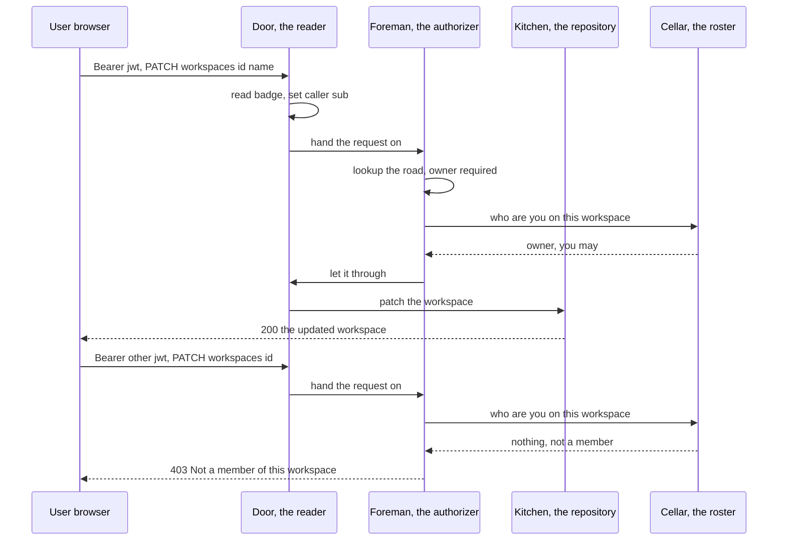
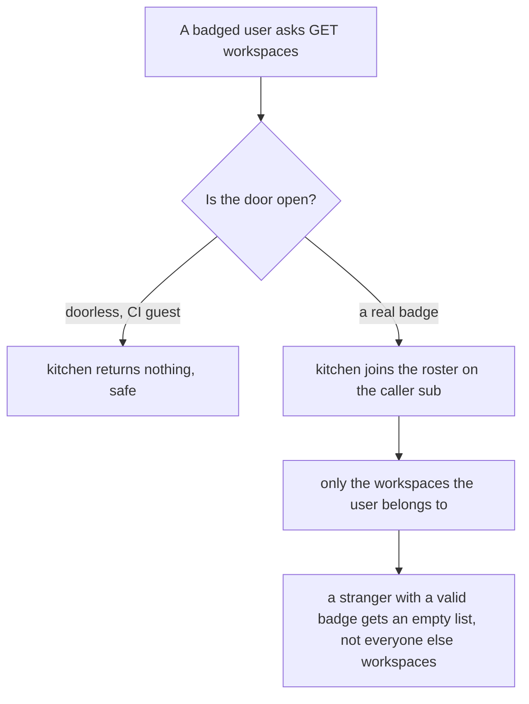

# Day 10 — Workspace ownership & RBAC

---

**TL;DR**
- The restaurant added a **back-of-house roster**: a `workspace_members` table now records *who belongs to which* workspace and *what they may do* (a role of exactly two: **owner** and **member**) — in both cellars, both kitchens.
- The new **authorizer** is a *layer above* the badge reader: a small **role ladder** with two **pure** decision functions, a **doorless pass-through** when no Auth0 is configured, and **two exact 403 strings** the receptionist turns into `{"error": "..."}`.
- **Own, create, patch, delete, invite** are all gated by it; the **list routes** (`GET /workspaces|/projects|/issues`) are *membership-scoped to the badge* so a stranger sees **nothing** rather than **everything**.
- Status: **PY 25 passed · TS 38 passed — zero services** (the ADR-010 CI gate held: the RBAC was added *doorless* on both kitchens, so still no Auth0 tenant, no DB, no browser in CI).
- **Named audit debt** *(the day-10 audit named three; after the day-11 closeout, **(a) is closed** and **(b) + (c)** carry to Day 12)*: **(a)** the **TS list routes** for projects & issues called `findAll*` = *everyone's* — the "mine" scope was applied to workspaces but *not* followed into projects/issues in TS — **closed in the day-11 closeout** (TS `findProjectsFor`/`findIssuesFor` landed and both list routes re-wired, so day-12 A.1 is now **verify-only**); **(b)** the **PY routes** carry **commented-out** membership checks that **dead-code the 403s** (CI runs doorless, so no test can fire them) — *carried*; **(c)** the **migration** for `workspace_members` was *not* added as a named cell — today the tables come from `create_all` / `db:push`, exactly the Day-3 "first-time renovator" debt ADR-008 left behind — *carried*.

---

## Built

- **The roster, in both cellars.** *The restaurant now keeps a laminated roster clip-board by the back door: a name, the team, and a badge — "owner" or "member".* It is the new `workspace_members` table (`workspace_members` in Drizzle's `db.ts`; the SQLAlchemy-mapped `workspace_members` in `models.py`) — a child of a workspace, a reference to a user, with a **role of exactly two values** (the `uq_ws_member` unique key: one role row per user per workspace, so an invite never double-issues a second badge).
- **The authorizer, in both kitchens.** *Above the badge reader, a small foreman now asks one more question: "do you hold the right badge for what you just tried?"* It is **`authorize.ts`** (`AuthorizeMiddleware` in the PY kitchen) — a **role ladder** (`member` < `owner`) and **two pure functions** (`assertRole` / `assert_role`) that decide the whole thing.
- **The route-level gating table.** *A chalkboard the foreman reads: for each menu line, exactly which badge it needs.* It is the `minRoleFor` map (`MIN_ROLE` in PY) — **PATCH/DELETE workspaces = owner**, **PATCH/DELETE projects & issues = member**, **POST /workspaces/:id/members = owner**. *No entry → public — the foreman does not look up that door at all.*
- **The two 403 sentences, in the receptionist.** *When the foreman says "not in the house" or "needs owner", the receptionist hands the guest a clean card — never the crash.* A new `ForbiddenError` (`errors.py` class; `errorTypes.ts` class) whose message is **exactly** `Not a member of this workspace` or `Requires the owner role`, registered to `403` in `register_error_handlers` / `registerErrorHandler`.
- **The membership endpoints.** *Two new menu lines, both behind the foreman:* **POST /workspaces/:id/members** (owner invites by user-id — upsert-or-`409 ConflictError` on a second badge for the same user, so *no `201`-then-broken-unique* trap) and **GET /workspaces/:id/members** (a read the badge-holder may see).
- **The "mine" scoping.** *The foreman is only half the answer. The other half is *what a badge-holder may *see*:* the **list routes** now ask the kitchen for *only the caller's* workspaces, not every workspace in the restaurant.* That is **`findWorkspacesFor(sub)`** / **`find_workspaces_for(sub)`** (a join through `workspace_members` on the badge), plus **`saveWorkspaceWithOwner`** / **`save_workspace_with_owner`** — *one transaction* that inserts the workspace **and** mints the creator as its owner, so there is no window in which a workspace exists with *no one* in charge.
- **The doorless pass-through.** *And the crucial bit for CI:* the authorizer reads the badge the reader (ADR-011) left on `request.user` — *never* re-verifying it — and, **when there is no Auth0 configured, lets every call through** as a doorless guest. *That is exactly the ADR-010 rule: the RBAC could land in both kitchens with zero new CI dependencies — no tenant, no key, no DB.*

## Learned

- **An authorizer is a *verifier*, not an *issuer*.** *I came in thinking the authorizer should "check the JWT". It does not — and must not.* The badge reader (ADR-011's `auth`) is the *only* thing that verifies a token; the authorizer *trusts the badge* it leaves on `request.user.sub` and reasons only about **role**. *Splitting "is this person who they claim to be?" (authentication) from "may this badge do this?" (authorization) is the whole lesson* — it keeps the authorizer a **pure function** of (sub, route), unit-testable without a tenant, without a key, without a browser. *(Auth0's own model: the badge is *read-only* for us; the *claim* `sub` is what we reason about.)*
- **The role ladder is a *number*, so rank is a *comparison*.** *One `Role` type with two members, and a one-line rank, gives the whole "can I do this?" a single shape: does my rank reach the route's minimum?* That is the `member < owner` ladder — `assertRole` is *literally* `rank(have) ≥ rank(need)`, and *adding a role later (an "editor" between the two) is a one-line change to the ladder*, not a rewrite of every route. *(This is the "role ladder as data" pattern — a rank function over an ordered role set, the shape every serious authorizer, from Rails `current_user` to a CAS server, reduces to.)*
- **A *pure* decision = the 403 is testable *offline*.** *Because `assertRole` is a function of strings, the *decision itself* is covered by the unit tests — the foreman's yes/no, the exact 403 messages, the doorless pass-through, the rank of an unknown route.* What it does *not* cover is the wiring that *plugs* the foreman into Fastify/FastAPI — *that* path (the middleware) runs in the doorless app-test, where it must pass through, and the *role-enforcing* 403s fire only under a real reader with a real claim. *(The honest split: **decision = unit-testable now**, **wiring = needs a badged test, which the CI rule says it may not have** — hence the *uncovered-403* debt below.)*
- **A *list* route's security is *membership*, not *badge*.** *The day's quiet, load-bearing idea:* gating a route with a badge only tells you *who* is asking; it does not tell you *whose things they may see*. *So the **list** routes don't gate — they **scope**: the kitchen hands back only what the badge-holder belongs to.* A stranger with a *valid* badge (a different workspace's member) asks `GET /workspaces` and gets **`[]`**, not *your* workspaces. *(This is the classic scoping-vs-gating split — and it is exactly the `findWorkspacesFor(sub)` join, mirroring how a tenant-scoped query in a multi-tenant app "just works" because the *where clause carries the tenant* and no one remembers to add it.)*
- **A second *uncovered-403* is born and must be *named* in the ADR** *(the ADR-011 `403 invalid` got a test; the new role 403s are the ones that can't, under CI):* under CI = doorless = no reader = **no `sub`** = the foreman passes through = **no 403 ever fires in CI**. *So the day closes having added 403 semantics we **cannot** exercise in CI, and the honest move is to **name** it and **resolve it the day a badged e2e is permitted (Day 12+)**, exactly as ADR-010 deferred the Auth0 e2e.*

---

## Broke & Fixed

> *(No command in this closeout needed fixing — the two suites were green when the audit began: **PY 25 · TS 38**. The "broke" of this *note* is the audit finding below, surfaced now because a note must record what the code *actually* says about itself.)*

- **The audit found three things the prompt's "same shape in both kitchens" did not survive into the working tree.** *The foreman reads a roster; then the whole restaurant's behavior splits into *what the two kitchens did *differently *about* it:*
  - **(a) *List scope — workspaces yes, projects & issues: PY yes, TS no.*** *The "mine" join was applied consistently to **workspaces** in both kitchens (`findWorkspacesFor` / `find_workspaces_for`) and to **projects/issues in PY** (`find_*_for(sub)`). BUT the **TS `GET /projects`** (L261) and **`GET /issues`** (L440) still call **`findAllProjects()`** / **`findAllIssues()`** = *everyone's* in the system — the prompt's B.x *explicitly* warned "a badged user in workspace A must not see B's **projects**, B's **issues**" and it was *not applied to the TS projects/issues list routes.* **Impact (real, not cosmetic):** a TS badged user in workspace A sees **every issue in the restaurant**. *Closed in the day-11 closeout* (`findProjectsFor`/`findIssuesFor` landed on the TS repo and the two list routes re-wired to the "mine" scope — so the day-12 A.1 is a **verify-only** row, not a build), *named here* per rule 11.
  - **(b) *The PY routes carry *commented-out* membership checks; the TS routes carry *active* inline checks on top of the middleware.*** *In the PY `server.py*` (e.g. L51-68, L105, L129, L210…) the role checks are **all commented** — the *only* live enforcement is the `AuthorizeMiddleware` + the `*_for(sub)` scoping. In the TS `server.ts`, the same checks are **live** inline `findMembership` + `ForbiddenError` blocks *in addition to* `authorizeHook`. So **the two kitchens are not "the same shape"**: PY = *middleware + scoping*, TS = *middleware + scoping + redundant inline*. The **TS inline checks are dead in CI** (doorless → no `sub` → the `sub!` non-null assertion guards *can't* fire) and — *in a configured door* — they **double** the middleware's 403 (defense in depth, tolerable). *The PY commented-blocks* are *leftover scaffolding* the build left behind. Named debt: *pick one* (recommend — per the day-11 Outcome & the ADR-012 closer: **middleware-only on *both*** kitchens — delete the TS inline `findMembership` blocks *and* the PY commented-out ones, so the role check lives **once** in the authorizer hook on both sides). Rule 11.
  - **(c) *The `workspace_members` migration was never added.* A.1* asked for "**add the migration to add** the `workspace_members` table … in *both* kitchens' migration files". The table exists in the *live* schema code (Drizzle `db.ts` + SQLAlchemy `models.py`) but **no named migration cell** was appended — today the tables still come from `create_all()`/`db:push`, *the exact ADR-008 "first-time-renovator" debt*. *Carried to the existing Day-11-adjacent migration work* (ADR-012 records the cut; the *actual* named migration is the natural next step and is a **zero-service** build). Rule 11.

## Request / Response Flow

> **Format note** — Mermaid (renders on GitHub / VS Code / Obsidian). *Labels below are kept plain per Day 8's parse rule (no `< >` / `{ }` / `;` / parens in message text); the badge value is written as words, not a header.*

### The foreman and the door — a badged write, and the stranger who knocks

### The "mine" scoping — the other half of the answer

*(Both diagrams should be re-parsed with the throwaway `mermaid`+`jsdom` harness when it is rebuilt — the install was skipped this session; the labels are written to Day-8's plain-label rule so the risk of a v12 lexer failure is low.)*

## Commands Ran

- **PY** — `pytest -q` → **25 passed** in ~5s (zero services). The new tests exercise the foreman *offline*: **`test_authorize.py`** — the two **exact 403 messages** (non-member vs wrong-role vs owner-pass via **`assert_role`**), the **doorless pass-through** (`AuthenticateBadgeMiddleware` leaves no `user` → `AuthorizeMiddleware` passes through → the app still returns the data), and the **role ladder**'s rank. *(The role-enforcing **wiring** under a real reader is the *uncovered-403* named above — a badged test, CI-forbidden.)*
- **TS** — `pnpm test` → **38 passed** (zero services). The new tests — **`test/authorize.test.ts`** — cover the same *pure foreman* surface: the **two 403 messages**, the **doorless pass-through** (a request with no `user` sails through `authorizeHook`), and the rank. *(Same honest split: the *decision* is unit-tested; the *middleware wiring* under a real reader is the uncovered 403.)*
- **The audit** — a read-only pass over `authorize.{ts,py}`, the list routes in `server.{ts,py}`, and the repositories, surfacing findings (a)/(b)/(c) above. No mutation.
- **The closeout** (this commit) — added: this note, **ADR-012** (decision record for the RBAC), the **Day-12/13 prompt** draft, a refreshed top-level **README** status line + journey row; appended the **ADR-012** row to the **ADR table** in the repo README; and the **RBAC feature** files (`authorize.*`, `constants.*`, `workspace_members`, `ForbiddenError`, the member routes). *Nothing was pushed* — the commit is proposed per the standing rule.

---

## Outcome & Next

**Status:** **Green** — PY 25 · TS 38, zero services. The RBAC **decision** (role ladder + doorless pass-through + two 403s + "mine" scoping) is a pure function, fully unit-testable, and **CI-clean by construction** (ADR-010 held: no new tenant/key/DB).

**Carried forward to the Day 12/13 prompt** *(the audit's named debt, now the *lead* of the next day — finding* **(a) is *closed* in the day-11 closeout; *(b) + *(c) *remain* the open debt):*

1. **Fix the TS projects & issues list routes** to the "mine" scope *(finding* **(a)** — A.1 of the next prompt) — *the *one* real RBAC gap the audit found* — **CLOSED in the day-11 closeout**: `findProjectsFor` / `findIssuesFor` *(the scoped joins)* *landed* on the *TS* *track*; **py/ts parity restored**.* *It *was* a *zero-service* two-method change — *no longer a *debt.*
2. **Pick one enforcement shape** *(finding* **(b)**) and kill the dead code — *recommended:* keep **`authorize`-middleware-only** on *both* kitchens, delete the TS inline `findMembership` blocks *and* the PY commented-out ones, so the two kitchens are *finally* the same shape (B.x).
3. **Add the named `workspace_members` migration** *(finding* **(c)** — A.3 of the next prompt) to both cellars — the *last* of ADR-008's "first-time renovator" cells; *zero-service*, the natural companion to the day-11 migration work.
4. Then **the real money story — Day 12/13: Razorpay checkout** *(the Day-11 RBAC was the *setup* for a *real* multi-user product with a real *payer*):* the **Razorpay checkout** + **Webhook receipt** + **Plan state machine** from the roadmap's Day 12-13. *This is the ADR's "when will this be revisited" — the moment a *payer* exists, the **two roles become the *two products*** (a team that **bought** vs one that was **invited** free-tier), and *that* is where the role ladder earns its keep: **a paid workspace's owner can *upgrade* the member role ladder — that is the product the whole RBAC layer was built to *unlock*.***

*One idea, one day: the RBAC is the *foundation* — the *product* is what the next day puts *on top* of it.*
